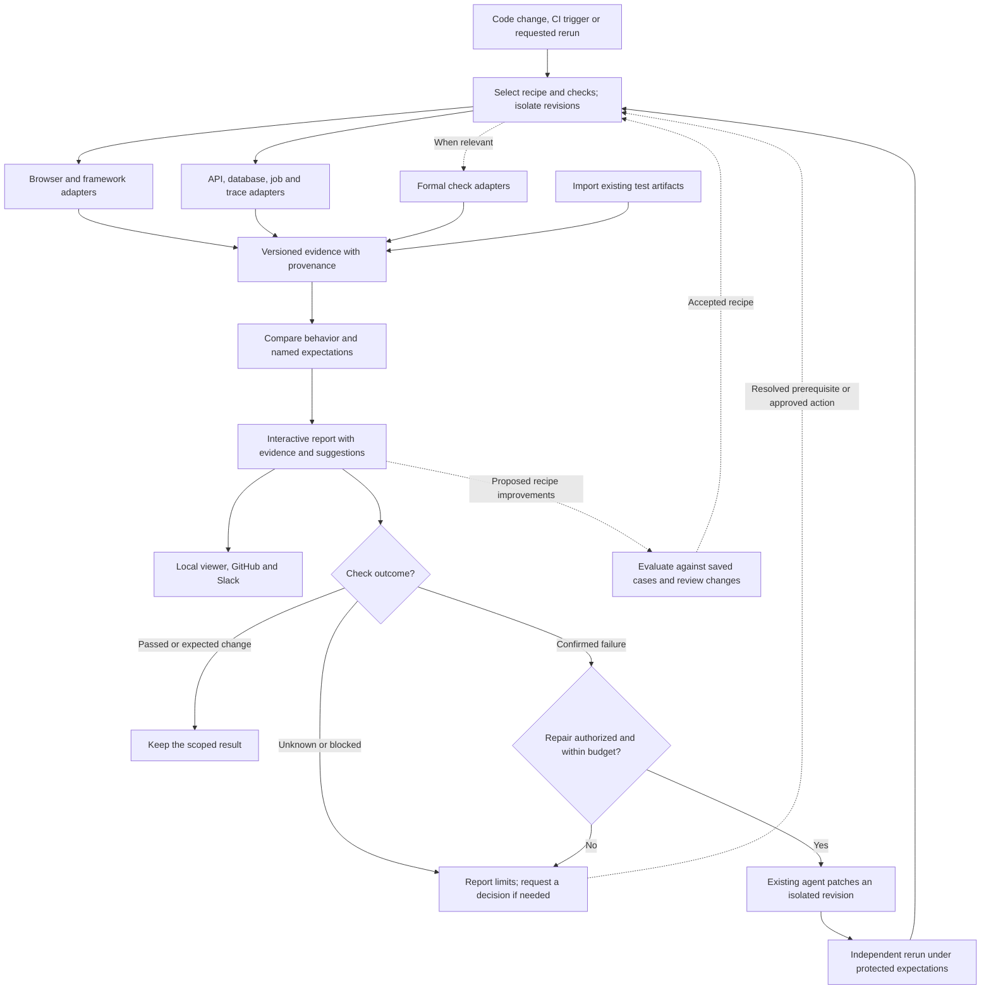

# Observed

Observed compares application behavior using browser evidence, named checks, and
source snapshots. It runs locally without a model or account.

The current capture path uses a controlled React application and one saved
journey: **Load items must send exactly one successful request**. It captures a
baseline, unchanged behavior, a seeded duplicate request, and an intentional
visual change. Connecting another application requires a trusted project recipe
in code; general application setup is not implemented yet.

The Phase 0 developer-adoption gate remains **unverified**. A successful fixture
run does not establish usefulness, comprehension, or time savings for developers.

## Try it

With Bun **1.4.2** installed, run one command from the checkout:

```bash
bun start
```

It installs the pinned dependencies and browser, runs the saved comparison, and
starts the local viewer. Open the printed localhost URL. Press Ctrl+C to stop.

Observed creates the manifests and evidence bundles itself. You do not supply a
manifest, assemble evidence, or run the capture steps individually. The browser
report opens on the duplicate-request case, where one click sends two requests.
The passing baseline, screenshots, request evidence, and named check are available
in the report.

Each run gets a new directory under `evidence/`. Earlier captures remain intact.

The saved local-fixture recipe launches Chrome
with `--no-sandbox`, restricts page traffic to loopback, and records its launch
arguments. Producer version: agent-browser **0.38.1**. Browser version and actual
viewport, locale, and timezone are recorded with every complete capture.

## Agent and integration interface

The commands below support agents, scripts, and integrations. They are not steps
a person needs to follow after `bun start`. An agent can prepare a trusted project
recipe and use the same capture and comparison contracts; humans inspect the
result in the viewer.

<details>
<summary>Lower-level commands and evidence contracts</summary>

| Command | Result |
| --- | --- |
| `bun run app` | Start the baseline application for manual use; prints its URL |
| `bun run app duplicate` | Start the deliberately broken application |
| `bun run capture base` | Capture a new baseline source snapshot |
| `bun run capture duplicate` | Capture the duplicate-request variant |
| `bun run capture visual` | Capture the intentional heading change |
| `bun run compare <base-dir> <candidate-dir>` | Evaluate evidence and export a new report bundle |
| `bun run compare none <candidate-dir>` | Evaluate the candidate's absolute check with no baseline |
| `bun run view [report-dir]` | Recheck and serve the selected report locally |

`capture`, `compare`, and `demo` support `--output <new-directory>` and `--json`.
JSON output uses the same schema-backed result shown to a person. A failed capture
exits nonzero and retains its failed manifest and available diagnostics.
`compare` exits successfully when it writes a report, including a report showing
a regression or unavailable comparison; consumers should inspect its result.

`bun run setup` installs the browser separately. On Linux,
`bun run setup --with-deps` also installs its system dependencies using the
producer's documented installer. An explicit `--output` directory must not exist.
`evidence/latest.json` is only a convenience pointer to the last selected report.

The check counts actual `GET /api/items` requests between the saved click and
completion followed by network idle. The expectation lives outside the candidate
application. The HAR, raw producer output, server request ledger, screenshots,
source files, and hashes remain available for inspection. The source identity is
a hash of the selected entry and sorted source-file hashes, including build and
dependency inputs.

A regression requires a comparable passing baseline followed by a failing
candidate. Screenshot byte changes are observations, not regressions. Missing,
failed, corrupted, stale (older than 24 hours), or incompatible captures make the
affected comparison unavailable. An independently executable candidate check
keeps its separate scope when only the baseline is unavailable.

### Portable reports

Copy the entire report directory, including `base/`, `candidate/`, and `assets/`.
Its Markdown report and artifact links are relative. On another checkout, run:

```bash
bun run view /path/to/copied-report
```

The local viewer verifies the selected manifest hashes and artifacts at startup
and serves those bytes with the computed result. Restart it to inspect later
disk changes. `report.md` and `result.json` record the export-time result.
Hashes detect changed bytes; they do not authenticate a rewritten bundle.

### Generated-manifest import

The version 1 importer remains available for existing integrations. Its behavior
claims stay labeled **imported**; integrity checking does not turn them into
checks executed by Observed. An agent or evidence producer generates the manifest;
it is an interchange format, not a user-authored input form.

The integration entry point is
`bun run report <generated-manifest.json> <new-report.md>`. The output parent must
exist and the output file must be new. Missing evidence is reported as unknown.
Exit success means written, not behavior verified. The retained
[TodoMVC excerpt](tests/fixtures/todomvc/README.md) demonstrates the
[version 1 contract](src/schema.ts).

</details>

## Development checks

```bash
bun run check
```

`bun run verify` exercises the live demo, timeout and SIGTERM cleanup, artifact
faults, stale/incompatible captures, and report serving. It retains every run under
`evidence/acceptance-<id>`. The strict screenshot-equality assertion currently
detects a small rounded-border rendering variation between identical variants;
the full acceptance command therefore remains failing. Request-count expectations
are unchanged. This increment is not a completed Phase 1 acceptance gate.

Reports and captures stay local under gitignored `evidence/`. Tests use Vitest
under Bun; `bun test` is not the project test command.

## Planned integrations

The implemented slice covers local fixture capture, deterministic comparison,
the viewer, portable reports, and version 1 imports. The broader flow below still
includes unimplemented application adapters, delivery, and repair:



Future repair must preserve the named expectations and create a new run. Changed
expectations require separate review.

### Later evidence types

| Evidence | What you can inspect |
| --- | --- |
| Browser and framework | Appearance, interactions, runtime errors, requests, performance, accessibility, component behavior |
| Backend | API contracts, database changes, job events, distributed traces |
| Formal checks, optional | A specified property, its assumptions, checker result, and connection to the implementation |

GitHub and Slack delivery, remote actions, and AI explanations remain unimplemented.
A passing result covers its named checks, not the entire application or permission
to merge.

## Project documents

[Product](docs/PRODUCT.md) · [Architecture](docs/ARCHITECTURE.md) · [Roadmap](docs/ROADMAP.md) · [Design](DESIGN.md) · [Contributor instructions](AGENTS.md)
