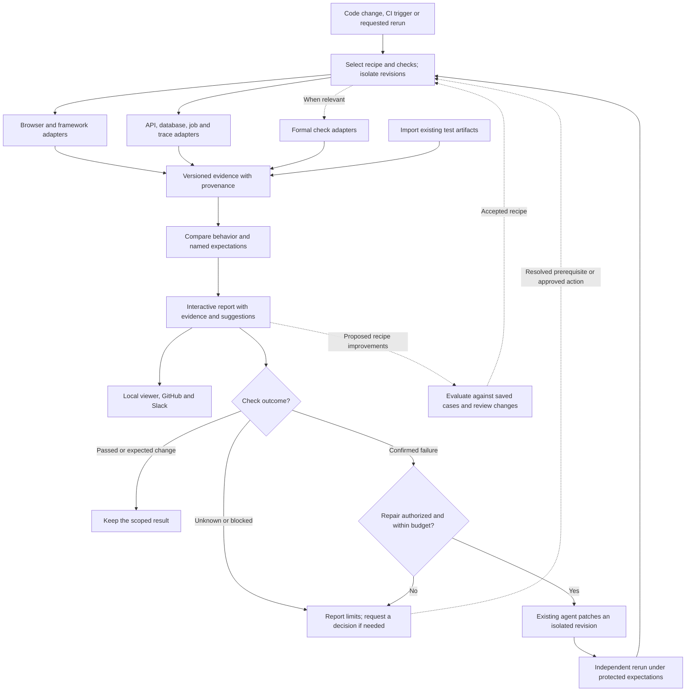

# Observed

See what you just built.

Observed captures the result of a code change in the running app. Preview a new
screen, put two versions side by side, or inspect the requests behind a click.
Your coding agent can prepare the project configuration and run captures. You
open the result.

Everything runs locally. No model or account is required to capture or view it.

## Try it

With Bun **1.4.2** installed, run from the checkout:

```bash
bun start
```

This installs dependencies and the browser, captures the Request lab example,
and starts the viewer. Open the printed localhost URL. Press Ctrl+C to stop.

Observed creates the evidence files. You don't write a manifest or collect
screenshots by hand.

<details>
<summary>Agent capture and import interfaces</summary>

Create `observed.json` using the [project contract](src/project.ts). It supplies
the source paths, setup/start commands, readiness, and page actions. Checks are
optional. The [React example](examples/request-lab/observed.json) and
[plain browser example](examples/shop/observed.json) use the same entry point.

Use `bun run observe /path/to/app --json` for a preview, or add `--base HEAD` to
compare the worktree with a commit. The JSON result includes the viewer directory
and check outcomes. Exit codes: `0` completed, `1` unavailable, `2` a named check
failed. A completed capture is not a claim that the whole application is correct.

A comparison also reports screenshot pixels. It counts pixels whose YIQ color
difference exceeds 0.1, on pixelmatch's threshold scale, and lists the changed
regions. Pixelmatch's anti-aliasing detection is not implemented, so counts can
differ from pixelmatch. When pixels change, Observed writes `visual-diff.png`
beside `report.md`. Smaller differences are still counted and located. A pixel change
never fails a run by itself, and screenshots that can't be decoded make the pixel
result unavailable.

For an app using a separate API or asset host, set `capture.allowedOrigins` to its
HTTP(S) origins, such as `["http://127.0.0.1:4000"]`. Request checks match the
application origin by default; set the check's `origin` to one of those allowed
origins to check that service. Observations version 2 records each request's origin.

agent-browser does not report the status of a request answered by a redirect,
such as a login form's POST followed by a 302 or 303. Observed records that
request with status `0` and shows it as not recorded. A request check can't match
it by status; check the request the redirect leads to.

A `fill` step's `value` is either literal text, exported as written, or an
environment reference such as `{ "env": "LOGIN_PASSWORD" }`. Recipes and evidence
keep only the variable name. Observed reads the variable when the capture runs,
and a missing or empty variable fails the capture. The value reaches agent-browser
on stdin, not in process arguments. Observed removes it from the transcript and
other text evidence, including JSON-escaped and URL-encoded copies. It matches
whole values only: a page that splits, truncates or transforms the value, such as
a URL cut at `#`, can leave part of it in evidence. Screenshots
keep whatever the page draws, so fill secrets only into fields that mask them,
such as password inputs.

`capture`, `compare`, and `view` support individual steps and saved evidence.
`compare none <capture>` exports a preview and uses the same exit codes as `observe`.
`view` opens a saved bundle as it was evaluated at export. It still rejects
evidence whose bytes changed afterward.

The version 1 importer accepts generated evidence bundles through
`bun run report <manifest.json> <new-report.md>`. The output parent must exist and
the output file must be new. Behavior claims remain labeled imported; missing
evidence is unknown. Exit success means written, not behavior verified.

See the [schema](src/schema.ts), [example manifest](tests/fixtures/todomvc/manifest.json),
and [TodoMVC provenance](tests/fixtures/todomvc/README.md). Keep input bundles immutable.

</details>

Development checks:

```bash
bun run check
```

`bun run test` runs the Vitest unit tests. `bun run verify` exercises capture and
the viewer against both example projects. Plain `bun test` stops with a pointer to
these scripts.
Reports and captures stay local under gitignored `evidence/`.

## Run on pull requests

Observed's GitHub Action captures your saved journey on the pull request's base
and candidate, compares the two, and uploads the evidence as a workflow artifact.
Your repository needs a committed `observed.json` following the
[project contract](src/project.ts). The job needs an Ubuntu runner with
passwordless `sudo`, which GitHub-hosted runners provide.

Add `.github/workflows/observed.yml`:

```yaml
name: Observed

on:
  pull_request:

permissions:
  contents: read

jobs:
  observe:
    runs-on: ubuntu-24.04
    timeout-minutes: 15
    steps:
      - uses: actions/checkout@3d3c42e5aac5ba805825da76410c181273ba90b1 # v7.0.1
        with:
          fetch-depth: 0
          persist-credentials: false
      - uses: esau-morais/observed@OBSERVED_COMMIT_SHA
        with:
          project: .
          base: ${{ github.event.pull_request.base.sha }}
```

- Replace `OBSERVED_COMMIT_SHA` with a full commit SHA from this repository that
  contains `action.yml`.
- Set `project` to the directory holding `observed.json`, relative to the
  repository root.
- `base` is the base commit recorded in the pull request event. It stays fixed
  when the base branch moves or the job is re-run. `fetch-depth: 0` fetches the
  history that contains it. The candidate defaults to `HEAD`, the merge commit
  GitHub checks out for the pull request.
- Observed reads `observed.json` from the checked-out working tree, which is the
  candidate when `candidate` is `HEAD`, and uses it for both revisions. A pull
  request that edits it changes the check for both sides, so review those edits
  like code.
- Keep the `pull_request` trigger. Do not use `pull_request_target`: it gives
  pull requests from forks the repository's secrets and a write token, and pull
  request code must not receive them.

The action installs the Bun version pinned in Observed's `package.json` and runs
your setup and start commands with it on `PATH`. It installs the browser and its
system packages with apt.

| Exit code | Conclusion | Job |
| --- | --- | --- |
| 0 | No regression, not checked, or preview | Passes |
| 1 | Unavailable: a revision or capture could not be used | Fails |
| 2 | A named check failed or regressed | Fails |

The job also fails when `observed.json` is rejected before capture, when Observed
writes no readable result, or when the result disagrees with the exit code.

The job summary states the conclusion, each side's revision, capture state,
and check outcome, and why a capture failed. Whenever the capture step ran, including failed comparisons,
the `observed-bundle` artifact is uploaded and kept for 7 days. It holds the raw
captures, `result.json`, and the exported viewer. To open it, download it and run
`bun run view <download>/run/report` from an Observed checkout.

Optional inputs: `candidate` (default `HEAD`), `timeout` per capture in
milliseconds (default `120000`), `artifact-name`, and `retention-days`. Give each
call a distinct `artifact-name` when one job runs the action more than once.

A journey that signs in reads its secret from an environment variable, as in
`{ "env": "LOGIN_PASSWORD" }`. Pass the repository secret to the action step:

```yaml
      - uses: esau-morais/observed@OBSERVED_COMMIT_SHA
        env:
          LOGIN_PASSWORD: ${{ secrets.LOGIN_PASSWORD }}
        with:
          project: .
          base: ${{ github.event.pull_request.base.sha }}
```

GitHub gives no Actions secrets to pull requests from forks or Dependabot. The
variable is then empty, both captures fail, and the job reports unavailable. Use
a disposable account: the uploaded bundle holds screenshots of every page the
journey reaches. Literal fill values, such as a username, appear in the bundle as
written, so never write a password as a literal value.

This repository runs the same action on the Request lab example in
[.github/workflows/observe.yml](.github/workflows/observe.yml).

## The planned complete flow



Every run checks permissions, records its revision and recipe, and retains the original artifacts. A repair loop stops when it succeeds, reaches its limits, makes no progress, or needs a decision. Changed expectations require a separate review.

## More than screenshots

| Evidence | What you can inspect |
| --- | --- |
| Browser and framework | Appearance, interactions, runtime errors, requests, performance, accessibility, component behavior |
| Backend | API contracts, database changes, job events, distributed traces |
| Formal checks, optional | A specified property, its assumptions, checker result, and connection to the implementation |

GitHub and Slack present the same report and offer authorized follow-up actions. Remote actions need a reachable runner. AI explanations stay labeled as interpretations; an unavailable check never becomes a pass. A passing result covers its named checks, not the entire application or permission to merge.

## Project documents

[Product](docs/PRODUCT.md) · [Architecture](docs/ARCHITECTURE.md) · [Roadmap](docs/ROADMAP.md) · [Design](DESIGN.md) · [Contributor instructions](AGENTS.md)
