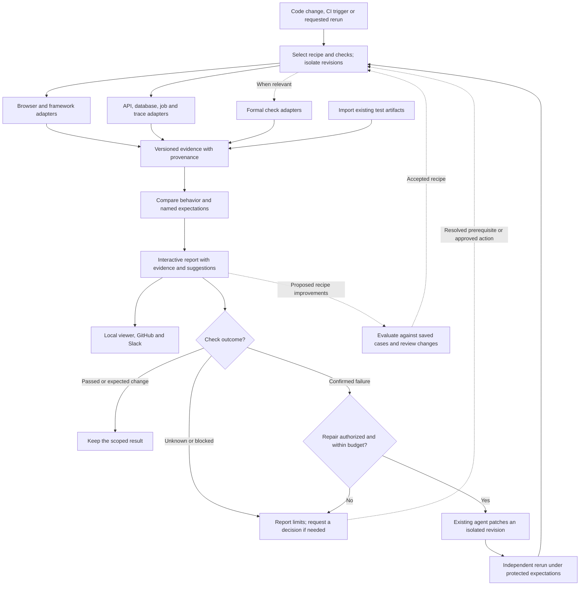

# Observed

Observed shows what a software change did, using evidence from the running system. Compare revisions, inspect changed behavior, and follow findings back to code. When a check fails, an existing coding agent can use the evidence to fix it, then Observed runs verification again.

Planned as an open-source, self-hostable tool for any coding agent and application framework, with local operation, portable reports, and optional AI. Browser applications come first.

> **Status: Phase 0 report CLI.** Observed generates Markdown from imported evidence,
> validates artifact references, and checks supplied hashes. Behavior results remain
> labeled as imported. The flow below describes the intended final system,
> including unimplemented capture, comparison, viewer, and repair paths.

## Generate a report

Install the Bun version declared in `package.json`, then run:

```bash
bun install --frozen-lockfile
mkdir -p evidence
run_dir="$(mktemp -d evidence/report-example.XXXXXX)"
cp -R tests/fixtures/todomvc/. "$run_dir/"
bun run report "$run_dir/manifest.json" "$run_dir/report.md"
```

Expect **1 imported passed, 0 imported failed, and 1 unknown check** from the
[TodoMVC excerpt](tests/fixtures/todomvc/README.md). Revision comparison is unknown.

For your evidence, place a version 1 manifest and artifacts in one directory, then
run `bun run report path/to/manifest.json path/to/new-report.md`. The output parent
must exist and the output file must be new. Missing evidence is reported as unknown.
Exit success means written, not behavior verified. See the
[schema](src/schema.ts) and [example manifest](tests/fixtures/todomvc/manifest.json).
Keep the input bundle immutable during generation and review.

Development checks:

```bash
bun run check
```

Reports and captures stay local under gitignored `evidence/`.

## The complete flow



Every run checks permissions, records its revision and recipe, and retains the original artifacts. A repair loop stops when it succeeds, reaches its limits, makes no progress, or needs a decision. Changed expectations require a separate review.

## More than screenshots

| Evidence | What you can inspect |
| --- | --- |
| Browser and framework | Appearance, interactions, runtime errors, requests, performance, accessibility, component behavior |
| Backend | API contracts, database changes, job events, distributed traces |
| Formal checks, optional | A specified property, its assumptions, checker result, and connection to the implementation |

GitHub and Slack present the same report and offer authorized follow-up actions. Remote actions need a reachable runner. AI explanations stay labeled as interpretations; an unavailable check never becomes a pass. A passing result covers its named checks, not the entire application or permission to merge.

## Project documents

[Product](docs/PRODUCT.md) · [Architecture](docs/ARCHITECTURE.md) · [Roadmap](docs/ROADMAP.md) · [Design](DESIGN.md) · [Contributor instructions](AGENTS.md)
