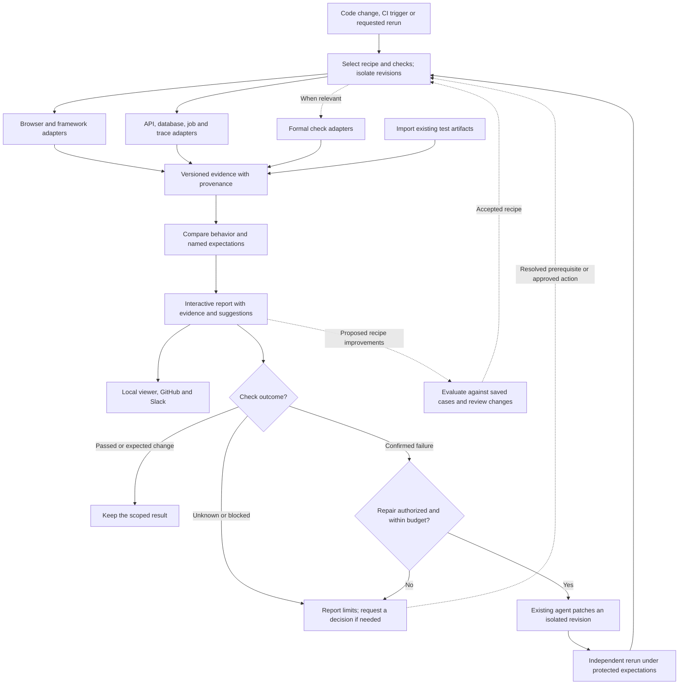

# Observed

See what you just built.

Observed captures the result of a code change in the running app. Preview a new
screen, put two versions side by side, or inspect the requests behind a click.
Your coding agent can prepare the project configuration and run captures. You
open the result.

Everything runs locally. No model or account is required to capture or view it.

## Try it

With Bun **1.4.2** installed, run from the checkout:

```bash
bun start
```

This installs dependencies and the browser, captures the Request lab example,
and starts the viewer. Open the printed localhost URL. Press Ctrl+C to stop.

Observed creates the evidence files. You don't write a manifest or collect
screenshots by hand.

<details>
<summary>Agent capture and import interfaces</summary>

Create `observed.json` using the [project contract](src/project.ts). It supplies
the source paths, setup/start commands, readiness, and page actions. Checks are
optional. The [React example](examples/request-lab/observed.json) and
[plain browser example](examples/shop/observed.json) use the same entry point.

Use `bun run observe /path/to/app --json` for a preview, or add `--base HEAD` to
compare the worktree with a commit. The JSON result includes the viewer directory
and check outcomes. Exit codes: `0` completed, `1` unavailable, `2` a named check
failed. A completed capture is not a claim that the whole application is correct.

`capture`, `compare`, and `view` support individual steps and saved evidence.

The version 1 importer accepts generated evidence bundles through
`bun run report <manifest.json> <new-report.md>`. The output parent must exist and
the output file must be new. Behavior claims remain labeled imported; missing
evidence is unknown. Exit success means written, not behavior verified.

See the [schema](src/schema.ts), [example manifest](tests/fixtures/todomvc/manifest.json),
and [TodoMVC provenance](tests/fixtures/todomvc/README.md). Keep input bundles immutable.

</details>

Development checks:

```bash
bun run check
```

`bun run verify` exercises capture and the viewer against both example projects.
Reports and captures stay local under gitignored `evidence/`.

## The planned complete flow



Every run checks permissions, records its revision and recipe, and retains the original artifacts. A repair loop stops when it succeeds, reaches its limits, makes no progress, or needs a decision. Changed expectations require a separate review.

## More than screenshots

| Evidence | What you can inspect |
| --- | --- |
| Browser and framework | Appearance, interactions, runtime errors, requests, performance, accessibility, component behavior |
| Backend | API contracts, database changes, job events, distributed traces |
| Formal checks, optional | A specified property, its assumptions, checker result, and connection to the implementation |

GitHub and Slack present the same report and offer authorized follow-up actions. Remote actions need a reachable runner. AI explanations stay labeled as interpretations; an unavailable check never becomes a pass. A passing result covers its named checks, not the entire application or permission to merge.

## Project documents

[Product](docs/PRODUCT.md) · [Architecture](docs/ARCHITECTURE.md) · [Roadmap](docs/ROADMAP.md) · [Design](DESIGN.md) · [Contributor instructions](AGENTS.md)
