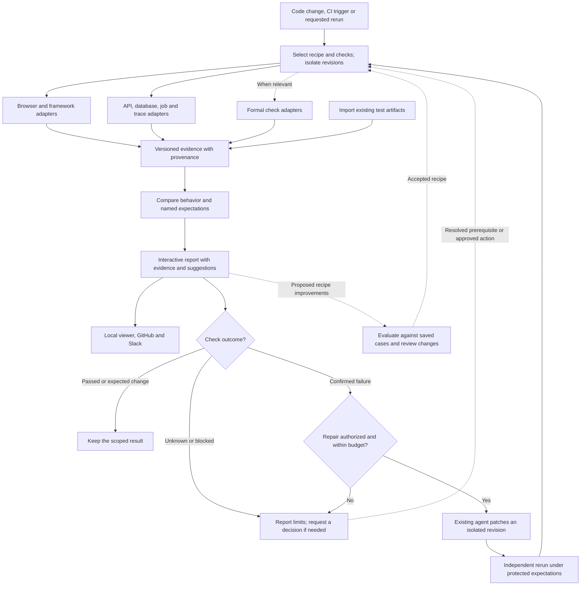

# Observed

See what you just built.

Observed captures the result of a code change in the running app. Preview a new
screen, put two versions side by side, or inspect the requests behind a click.
Your coding agent can prepare the project configuration and run captures. You
open the result.

Everything runs locally. No model or account is required to capture or view it.

## Install

Observed runs on Linux x64 and macOS, Intel or Apple silicon, with
[Bun](https://bun.sh/docs/installation) 1.4.2 or later. Windows and Linux on
arm64 are not supported: Chrome for Testing, which Observed captures with,
publishes no Linux arm64 build.

```bash
bun add --global @observed-software/cli
observed setup
```

Bun reports one blocked postinstall. It belongs to agent-browser, which already
ships its binaries, so leave it blocked. `observed setup` downloads the Chrome
build Observed captures with, about 190 MB. On a Linux machine without desktop
libraries, such as a container, run `observed setup --with-deps` instead; it
also installs system packages with `sudo apt`.

To use a pinned version without installing it, start each command with
`bunx @observed-software/cli@<version>` instead of `observed`, as in
`bunx @observed-software/cli@0.1.0 setup`.

## Use it on your app

Ask your coding agent to write `observed.json` in your app's directory by
following [Write observed.json](#write-observedjson). Then, from that directory:

```bash
observed observe --json              # preview the working tree
observed observe --base HEAD --json  # compare it with a commit
```

Pass the app's directory as an argument to run from elsewhere, as in
`observed observe path/to/app --json`.

Without `--json`, `observe` opens the viewer and runs until you press Ctrl+C.
Evidence goes to `.observed/` in the app's directory, which holds its own
`.gitignore`, so Git ignores it without changes to your repository. The JSON
output's `directory` is the report, and `observed view <directory>` opens it
again. `observed view path/to/app` opens the app's latest run, and
`observed view` with no argument opens the current directory's latest run.
With `--output`, Observed writes only to that directory. Exit codes: `0` completed, `1` unavailable, `2` a
named check failed or regressed. When Observed rejects `observed.json`, it prints no JSON
and explains why on stderr.

Each capture, from setup through the journey, must finish within `--timeout`
milliseconds, 120000 by default. Raise it when installing and building the app
takes longer. `observed <command> --help` lists every option.

### Write observed.json

The [project schema](src/project.ts) and
[step and check schema](src/capture/recipe.ts) list every field.

- `source.paths` lists every file or directory the app needs to build and run,
  including lockfiles, relative to the directory that holds `observed.json` and
  without `..`. An app that needs sibling directories, such as monorepo
  packages, puts `observed.json` in a common parent.
  Observed copies only these into a temporary directory, from the revision being
  captured or from the working tree. It skips gitignored files, `node_modules`,
  `dist`, `build`, `.git`, `.env*`, and credential and key files, so `setup`
  must recreate build output. Symlinks are rejected. `source.entry` names one of
  the listed files.
- `setup` commands run in order inside that copy. Each is an argument array with
  no shell; use `["sh", "-c", "..."]` when you need one. They see only `PATH`,
  `HOME`, `LANG` and `TZ`.
- `start` is one command that keeps the app running. It receives `PORT` and
  `HOST=127.0.0.1`, and Observed replaces `{port}` in its arguments with the
  port. Its only other variables are `PATH`, `LANG`, `TZ` and `HOME`, which is
  the copy. Set anything else the app needs, such as `NODE_ENV`, inside an
  `sh -c` command. The app must listen on `127.0.0.1` at that port.
- An app with several processes, such as a frontend and a separate API, starts
  the real ones from one script or `sh -c` command. Don't write a replacement
  server: Observed would capture the replacement, not your code. A service on a
  fixed port works because the base and candidate captures run one after the
  other. Add its origin to `capture.allowedOrigins`.
- `ready` is a path and status that Observed polls until the app answers. It
  doesn't follow redirects, so pick a path that answers with that status
  directly, such as `/login` with 200 rather than `/` with 302.
- The browser opens `capture.path` and runs `capture.ready` without recording
  requests. It records requests from `capture.steps`, the journey under test. To
  record the page load itself, start `steps` with a `navigate` step. A request
  during `steps` to an origin outside the app and `allowedOrigins`, such as a
  font CDN or analytics, fails the capture.
- `capture.check` is optional and holds one `request-count` or `text` check. A
  `request-count` check counts requests during `steps` to the app's origin, or
  to the check's `origin` when set, whose method, path and status match. It
  compares the path without the query string or fragment, so
  `/api/items` counts both `/api/items` and `/api/items?page=2`, and the check's
  `path` can't contain `?` or `#`. A `text` check passes when exactly one element
  matches its selector and its text equals `expectedText`.
- Put the expected result in the check, not in a step. A step that waits for the
  expected text times out when the app regresses, and the run reports
  unavailable instead of a failed check. Wait for something both versions show,
  such as the table rows, then check the value.
- Sign in with a disposable account from committed seed data. `setup` doesn't
  receive fill variables, so commit the account with its password hash and pass
  the password through the fill variable. Observed can't complete a second
  factor such as a TOTP code, SMS or email link, so give that account none.
- Ubuntu 23.10 and later, including GitHub's `ubuntu-24.04` runners, block
  Chrome's sandbox, and Chrome exits with "No usable sandbox". On those systems,
  set `capture.browserArguments` to `["--no-sandbox"]`.
- `--base` captures that commit's copy of `source.paths` but uses the working
  tree's `observed.json`. A start script that exists only in the working tree
  makes the base capture fail, so commit it before comparing.

<details>
<summary>Agent capture and import interfaces</summary>

The [React example](examples/request-lab/observed.json) and
[plain browser example](examples/shop/observed.json) use the same entry point.
A completed capture is not a claim that the whole application is correct.

A comparison also reports screenshot pixels. It counts pixels whose YIQ color
difference exceeds 0.1, on pixelmatch's threshold scale, and lists the changed
regions. Pixelmatch's anti-aliasing detection is not implemented, so counts can
differ from pixelmatch. When pixels change, Observed writes `visual-diff.png`
beside `report.md`. Smaller differences are still counted and located. A pixel change
never fails a run by itself, and screenshots that can't be decoded make the pixel
result unavailable.

For an app using a separate API or asset host, set `capture.allowedOrigins` to its
HTTP(S) origins, such as `["http://127.0.0.1:4000"]`. Request checks match the
application origin by default; set the check's `origin` to one of those allowed
origins to check that service. Observations version 2 records each request's origin.

agent-browser does not report the status of a request answered by a redirect,
such as a login form's POST followed by a 302 or 303. Observed records that
request with status `0` and shows it as not recorded. A request check can't match
it by status; check the request the redirect leads to.

A `fill` step's `value` is either literal text, exported as written, or an
environment reference such as `{ "env": "LOGIN_PASSWORD" }`. Recipes and evidence
keep only the variable name. Observed reads the variable when the capture runs,
and a missing or empty variable fails the capture. The value reaches agent-browser
on stdin, not in process arguments. Observed removes it from the transcript and
other text evidence, including JSON-escaped and URL-encoded copies. It matches
whole values only: a page that splits, truncates or transforms the value, such as
a URL cut at `#`, can leave part of it in evidence. Screenshots
keep whatever the page draws, so fill secrets only into fields that mask them,
such as password inputs.

`capture`, `compare`, and `view` support individual steps and saved evidence.
`compare none <capture>` exports a preview and uses the same exit codes as `observe`.
`view` opens a saved bundle as it was evaluated at export. It still rejects
evidence whose bytes changed afterward.

From a checkout of this repository, the version 1 importer accepts generated
evidence bundles through `bun run report <manifest.json> <new-report.md>`. The
output parent must exist and the output file must be new. Behavior claims remain labeled imported; missing
evidence is unknown. Exit success means written, not behavior verified.

See the [schema](src/schema.ts), [example manifest](tests/fixtures/todomvc/manifest.json),
and [TodoMVC provenance](tests/fixtures/todomvc/README.md). Keep input bundles immutable.

</details>

## Develop Observed

With Bun **1.4.2**, run the Request lab example from a checkout:

```bash
git clone https://github.com/esau-morais/observed
cd observed
bun start
```

This installs dependencies and the browser, captures the example, and starts
the viewer. Open the printed localhost URL. Press Ctrl+C to stop. In a checkout,
`bun run observe`, `bun run setup` and `bun run view` run the CLI from source,
as in `bun run observe examples/shop` followed by `bun run view examples/shop`.

Development checks:

```bash
bun run check
```

`bun run test` runs the Vitest unit tests. `bun run verify` exercises capture and
the viewer against both example projects. Plain `bun test` stops with a pointer to
these scripts. `bun run build` writes the published CLI and viewer to `dist/`.
Test reports stay local under gitignored `evidence/`.

To release, set the new `version` in `package.json`, add a `CHANGELOG.md`
entry headed `## <version> (<date>)`, merge, and push the tag `v<version>`.
[.github/workflows/release.yml](.github/workflows/release.yml) installs the
packed CLI on Linux x64 and macOS on Intel and Apple silicon, and runs the Request lab example
through it. It then publishes that tarball to npm with provenance, creates the
GitHub release, and moves the major tag, such as `v0`, to the release commit.
The tagged commit must be on `main`.

npm can only trust a workflow for a package that already exists, so the first
release needs a token once:

1. Create a granular npm access token that can publish to the
   `@observed-software` organization, with a short expiry. Store it as the
   `NPM_TOKEN` secret of the `npm` environment in this repository.
2. Push the tag and let the release workflow publish.
3. On npmjs.com, open the package's settings, add this repository's
   `release.yml` workflow and the `npm` environment as a trusted publisher,
   and select "Require two-factor authentication and disallow tokens".
4. Delete the npm token and the `NPM_TOKEN` secret.

## Run on pull requests

Observed's GitHub Action captures your saved journey on the pull request's base
and candidate, compares the two, and links a report page from the job summary.
Your repository needs a committed `observed.json` following the
[project contract](src/project.ts). The job needs an `ubuntu-24.04` or
`macos-15` runner. On Linux it installs packages with passwordless `sudo`, which
GitHub-hosted runners provide.

Add `.github/workflows/observed.yml`:

```yaml
name: Observed

on:
  pull_request:

permissions:
  contents: read

jobs:
  observe:
    runs-on: ubuntu-24.04
    timeout-minutes: 15
    steps:
      - uses: actions/checkout@3d3c42e5aac5ba805825da76410c181273ba90b1 # v7.0.1
        with:
          fetch-depth: 0
          persist-credentials: false
      - uses: esau-morais/observed@OBSERVED_COMMIT_SHA
        with:
          project: .
          base: ${{ github.event.pull_request.base.sha }}
```

- Replace `OBSERVED_COMMIT_SHA` with the full commit SHA of a
  [release](https://github.com/esau-morais/observed/releases) tag. The action
  installs the Observed CLI with that release's version.
- Set `project` to the directory holding `observed.json`, relative to the
  repository root.
- `base` is the base commit recorded in the pull request event. It stays fixed
  when the base branch moves or the job is re-run. `fetch-depth: 0` fetches the
  history that contains it. The candidate defaults to `HEAD`, the merge commit
  GitHub checks out for the pull request.
- Observed reads `observed.json` from the checked-out working tree, which is the
  candidate when `candidate` is `HEAD`, and uses it for both revisions. A pull
  request that edits it changes the check for both sides, so review those edits
  like code.
- Keep the `pull_request` trigger. Do not use `pull_request_target`: it gives
  pull requests from forks the repository's secrets and a write token, and pull
  request code must not receive them.

The action installs the Bun version pinned in Observed's `package.json` and runs
your setup and start commands with it on `PATH`. It installs the browser, and
on Linux its system packages with apt. It installs nothing else. When `setup` or
`start` needs another toolchain, such as Go, Python or Node.js, install it in a
step before Observed's, with the version your project uses:

```yaml
      - uses: actions/setup-go@b7ad1dad31e06c5925ef5d2fc7ad053ef454303e # v7.0.0
        with:
          go-version-file: go.mod
      - uses: esau-morais/observed@OBSERVED_COMMIT_SHA
```

Pin those actions by full commit SHA, as here.

| Exit code | Conclusion | Job |
| --- | --- | --- |
| 0 | No regression, not checked, or preview | Passes |
| 1 | Unavailable: a revision or capture could not be used | Fails |
| 2 | A named check failed or regressed | Fails |

The job also fails when `observed.json` is rejected before capture, when Observed
writes no readable result, or when the result disagrees with the exit code.

The job summary states the conclusion, each side's revision, capture state, and
check outcome, and why a capture failed. Its **Open the report** link opens
`observed-bundle.html` in the browser: the same report as `observed view`, with
the screenshots, changed regions, checks, requests and original artifacts in
one file. GitHub shows it only to signed-in users who can read the repository;
a signed-out visitor gets a 404, even on a public repository. GitHub serves it
through a storage link that expires after about 10 minutes, so share the
summary link rather than the address the page opens at.

Whenever the capture step ran, including failed comparisons, the action also
uploads the `observed-bundle` artifact. It holds the raw captures,
`result.json`, and the exported viewer. To open it with a
local server, download it and run `observed view <download>/run/report`.
GitHub keeps both artifacts for 7 days by default.

Optional inputs: `candidate` (default `HEAD`), `timeout` per capture in
milliseconds (default `120000`), `artifact-name`, and `retention-days`. The
report page is named after `artifact-name` with `.html` added. Give each call a
distinct `artifact-name` when a workflow runs the action more than once, such
as in a matrix.

A journey that signs in reads its secret from an environment variable, as in
`{ "env": "LOGIN_PASSWORD" }`. Pass the repository secret to the action step:

```yaml
      - uses: esau-morais/observed@OBSERVED_COMMIT_SHA
        env:
          LOGIN_PASSWORD: ${{ secrets.LOGIN_PASSWORD }}
        with:
          project: .
          base: ${{ github.event.pull_request.base.sha }}
```

GitHub gives no Actions secrets to pull requests from forks or Dependabot. The
variable is then empty, both captures fail, and the job reports unavailable. Use
a disposable account: the report page and bundle hold screenshots of every page
the journey reaches. Literal fill values, such as a username, appear in both as
written, so never write a password as a literal value.

### Post results to the pull request

With a GitHub App, the action also posts each result as an **Observed** check run
and as a pull request comment. The check shows in the merge box, and its
Details link opens the report page. The comment has the same verdict, revisions
and report link, and later runs edit it instead of adding new ones. A workflow
that calls the action more than once, such as a matrix, gets one check and one
comment per `artifact-name`. The App needs
no server or webhook: the job creates a short-lived token after capture finishes.

1. Create a GitHub App under your account or organization's Developer settings.
   Give it **Checks: Read and write** and **Pull requests: Read and write**.
   Leave the webhook inactive and subscribe to no events.
2. Install it on the repositories that run Observed, and only those.
3. Generate a private key. Store it as the repository secret
   `OBSERVED_APP_PRIVATE_KEY` and the App's Client ID as the repository variable
   `OBSERVED_APP_CLIENT_ID`, then delete the downloaded key file.
4. Pass both to the action and grant nothing extra to the workflow token. The
   `concurrency` block cancels an older run, so it can't overwrite the comment
   with a stale result:

```yaml
concurrency:
  group: observed-${{ github.event.pull_request.number }}
  cancel-in-progress: true

jobs:
  observe:
    runs-on: ubuntu-24.04
    timeout-minutes: 15
    steps:
      - uses: actions/checkout@3d3c42e5aac5ba805825da76410c181273ba90b1 # v7.0.1
        with:
          fetch-depth: 0
          persist-credentials: false
      - uses: esau-morais/observed@OBSERVED_COMMIT_SHA
        with:
          project: .
          base: ${{ github.event.pull_request.base.sha }}
          github-app-client-id: ${{ vars.OBSERVED_APP_CLIENT_ID }}
          github-app-private-key: ${{ secrets.OBSERVED_APP_PRIVATE_KEY }}
```

The action posts only when the captured candidate is the pull request's head
commit or the merge commit GitHub checks out for it. To run Observed again, re-run the
workflow. The **Re-run** button on the Observed check itself does nothing,
because the App has no server to receive it.

| Result | Check conclusion |
| --- | --- |
| Regression, check failed, unavailable, or no readable result | Failure |
| No regression | Success |
| Not checked or preview | Neutral |

GitHub treats a neutral check as passing when you make it required, so a project
without a named check can merge on a neutral Observed check. Add a check to
`observed.json` before you require it.

Pull requests from forks and Dependabot receive no secrets, so the App posts
nothing for them. The job summary still shows the result and says why nothing
was posted, and the job passes or fails on Observed's result as before. A
required Observed check stays missing on those pull requests until a maintainer
runs the workflow with credentials.

### Post failures to Slack

The action can also post to one Slack channel. It sends a message when a pull
request's result starts failing: a regression, a failed check, or unavailable
evidence. Later runs of that pull request edit the same message, including a
recovery to no regression, so retries don't notify anyone again. A pull request
that never fails posts nothing, and runs outside pull requests post nothing.

The message has the same headline as the GitHub check, each side's revision,
capture and check outcome, and links to the pull request, report page, check and
workflow run. It leaves out measured values and captured text, because a
channel can include people who can't read the repository. A workflow that runs
the action more than once gets one message per `artifact-name`.

Editing the earlier message needs the GitHub App above, because its comment
remembers which Slack message belongs to the pull request. Without the App,
every failing run posts a new message.

1. Create a Slack app at https://api.slack.com/apps with **From a manifest** and
   give its bot only the `chat:write` scope:

   ```yaml
   display_information:
     name: Observed
   features:
     bot_user:
       display_name: Observed
       always_online: false
   oauth_config:
     scopes:
       bot:
         - chat:write
   settings:
     org_deploy_enabled: false
     socket_mode_enabled: false
     token_rotation_enabled: false
   ```

2. Install it to the workspace and copy the **Bot User OAuth Token**
   (`xoxb-...`). Store it as the repository secret `OBSERVED_SLACK_BOT_TOKEN`.
   The app needs no app-level token.
3. Invite the bot to the channel with `/invite @Observed`. Copy the channel ID,
   such as `C0123456789`, from the bottom of the channel's **About** tab and
   store it as the repository variable `OBSERVED_SLACK_CHANNEL`. A channel name
   doesn't work.
4. Add both to the action:

   ```yaml
             slack-bot-token: ${{ secrets.OBSERVED_SLACK_BOT_TOKEN }}
             slack-channel: ${{ vars.OBSERVED_SLACK_CHANNEL }}
   ```

The report link needs a GitHub account that can read the repository. Pull
requests from forks and Dependabot receive no secrets, so they post nothing to
Slack either.

This repository runs the same action on the Request lab example in
[.github/workflows/observe.yml](.github/workflows/observe.yml).

## The planned complete flow


```mermaid
flowchart TD
    T["Code change, CI trigger or requested rerun"] --> R["Select recipe and checks; isolate revisions"]
    R --> B["Browser and framework adapters"]
    R --> S["API, database, job and trace adapters"]
    R -. "When relevant" .-> F["Formal check adapters"]
    B --> E["Versioned evidence with provenance"]
    S --> E
    F --> E
    I["Import existing test artifacts"] --> E
    E --> C["Compare behavior and named expectations"]
    C --> V["Interactive report with evidence and suggestions"]
    V --> D["Local viewer, GitHub and Slack"]
    V --> Q{"Check outcome?"}
    Q -->|Passed or expected change| N["Keep the scoped result"]
    Q -->|Unknown or blocked| U["Report limits; request a decision if needed"]
    Q -->|Confirmed failure| G{"Repair authorized and within budget?"}
    G -->|No| U
    G -->|Yes| A["Existing agent patches an isolated revision"]
    A --> J["Independent rerun under protected expectations"]
    J --> R
    U -. "Resolved prerequisite or approved action" .-> R
    V -. "Proposed recipe improvements" .-> L["Evaluate against saved cases and review changes"]
    L -. "Accepted recipe" .-> R
```

Every run checks permissions, records its revision and recipe, and retains the original artifacts. A repair loop stops when it succeeds, reaches its limits, makes no progress, or needs a decision. Changed expectations require a separate review.

## More than screenshots

| Evidence | What you can inspect |
| --- | --- |
| Browser and framework | Appearance, interactions, runtime errors, requests, performance, accessibility, component behavior |
| Backend | API contracts, database changes, job events, distributed traces |
| Formal checks, optional | A specified property, its assumptions, checker result, and connection to the implementation |

GitHub and Slack present the same report and offer authorized follow-up actions. Remote actions need a reachable runner. AI explanations stay labeled as interpretations; an unavailable check never becomes a pass. A passing result covers its named checks, not the entire application or permission to merge.

## Project documents

[Product](docs/PRODUCT.md) · [Architecture](docs/ARCHITECTURE.md) · [Roadmap](docs/ROADMAP.md) · [Design](DESIGN.md) · [Contributor instructions](AGENTS.md)
