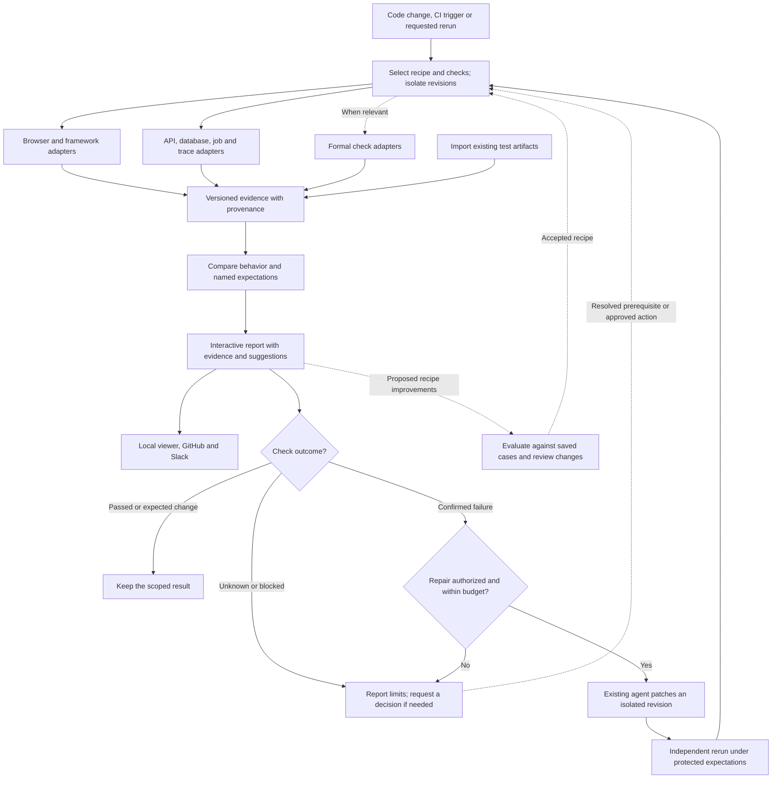

# Observed

See what you just built.

Observed captures the result of a code change in the running app. Preview a new
screen, put two versions side by side, or inspect the requests behind a click.
Your coding agent can prepare the project configuration and run captures. You
open the result.

Everything runs locally. No model or account is required to capture or view it.

## Install

Observed runs on Linux x64 and macOS, Intel or Apple silicon, with
[Bun](https://bun.sh/docs/installation) 1.4.2 or later. Windows and Linux on
arm64 are not supported: Chrome for Testing, which Observed captures with,
publishes no Linux arm64 build.

```bash
bun add --global @observed-software/cli
observed setup
```

Bun reports one blocked postinstall. It belongs to agent-browser, which already
ships its binaries, so leave it blocked. `observed setup` downloads the Chrome
build Observed captures with, about 190 MB. On a Linux machine without desktop
libraries, such as a container, run `observed setup --with-deps` instead; it
also installs system packages with `sudo apt`.

To use a pinned version without installing it, start each command with
`bunx @observed-software/cli@<version>` instead of `observed`, as in
`bunx @observed-software/cli@0.1.0 setup`.

Prereleases are published under an npm dist-tag named after their identifier.
Install the current alpha with
`bun add --global @observed-software/cli@alpha`. A plain install stays on the
latest release.

## Use it on your app

Ask your coding agent to write `observed.json` in your app's directory by
following [Write observed.json](#write-observedjson). Then, from that directory:

```bash
observed observe --json              # preview the working tree
observed observe --base HEAD --json  # compare it with a commit
```

Pass the app's directory as an argument to run from elsewhere, as in
`observed observe path/to/app --json`.

Without `--json`, `observe` opens the viewer and runs until you press Ctrl+C.
Evidence goes to `.observed/` in the app's directory, which holds its own
`.gitignore`, so Git ignores it without changes to your repository. The JSON
output's `directory` is the report, and `observed view <directory>` opens it
again. `observed view path/to/app` opens the app's latest run, and
`observed view` with no argument opens the current directory's latest run.
With `--output`, Observed writes only to that directory. Exit codes: `0` completed, `1` unavailable, `2` a
named check failed or regressed. When Observed rejects `observed.json`, it prints no JSON
and explains why on stderr.

Each capture, from setup through the journey, must finish within `--timeout`
milliseconds, 120000 by default. Raise it when installing and building the app
takes longer. `observed <command> --help` lists every option.

### Write observed.json

The [project schema](src/project.ts) and
[step and check schema](src/capture/recipe.ts) list every field.

- `source.paths` lists every file or directory the app needs to build and run,
  including lockfiles, relative to the directory that holds `observed.json` and
  without `..`. An app that needs sibling directories, such as monorepo
  packages, puts `observed.json` in a common parent.
  Observed copies only these into a temporary directory, from the revision being
  captured or from the working tree. It skips gitignored files, `node_modules`,
  `dist`, `build`, `.git`, `.env*`, and credential and key files, so `setup`
  must recreate build output. Symlinks are rejected. `source.entry` names one of
  the listed files.
- `setup` commands run in order inside that copy. Each is an argument array with
  no shell; use `["sh", "-c", "..."]` when you need one. They see only `PATH`,
  `HOME`, `LANG` and `TZ`.
- `start` is one command that keeps the app running. It receives `PORT` and
  `HOST=127.0.0.1`, and Observed replaces `{port}` in its arguments with the
  port. Its only other variables are `PATH`, `LANG`, `TZ` and `HOME`, which is
  the copy. Set anything else the app needs, such as `NODE_ENV`, inside an
  `sh -c` command. The app must listen on `127.0.0.1` at that port.
- An app with several processes, such as a frontend and a separate API, starts
  the real ones from one script or `sh -c` command. Don't write a replacement
  server: Observed would capture the replacement, not your code. A service on a
  fixed port works because the base and candidate captures run one after the
  other. Add its origin to `capture.allowedOrigins`.
- `ready` is a path and status that Observed polls until the app answers. It
  doesn't follow redirects, so pick a path that answers with that status
  directly, such as `/login` with 200 rather than `/` with 302.
- The browser opens `capture.path` and runs `capture.ready` without recording
  requests. It records requests from `capture.steps`, the journey under test. To
  record the page load itself, start `steps` with a `navigate` step. A request
  during `steps` to an origin outside the app and `allowedOrigins`, such as a
  font CDN or analytics, fails the capture.
- `capture.checks` is an optional list of named checks, each with a unique
  `id`, a `name` and a `scope` that says what it covers. `capture.check` still
  accepts a single check; set one or the other. The run concludes regression if
  any check regressed, check failed if any check failed, and unavailable if a
  check is unknown, naming it. Otherwise it concludes no regression. Reports
  and GitHub and Slack messages say how many checks passed, as in "3 of 4
  checks passed", and list each check with its scope.
- To capture more than one journey, replace `capture` with `journeys`, a list
  of one to three objects shaped like `capture`, each with a unique `name`.
  Each journey is its own capture of each revision, with its own setup and app
  start, so three journeys take about three times as long. `--timeout` still
  applies to each capture; raise the job's time limit to match. `observed
  capture` takes the first journey, or the one named by `--journey`.
- A journey's optional `collectors` list records more evidence after `steps`,
  with or without a check reading it. Checks add the collectors they need. The
  [evidence kinds](src/evidence-kinds/index.ts) list what can be collected.
- A check is `request-count`, `text` or `react-renders`. A
  `request-count` check counts the requests during `steps` whose method, path
  and status match. It counts requests to the app's origin, or to the check's
  `origin` when set. It compares the path without the query string or
  fragment, so `/api/items` counts both `/api/items` and `/api/items?page=2`,
  and the check's `path` can't contain `?` or `#`. A `text` check passes when exactly one element
  matches its selector and its text equals `expectedText`.
- A `react-renders` check fails when the component named in `component` renders
  more than `maxRenders` times during `steps`. It adds the `{ "kind": "react" }`
  collector, which you can also list in `collectors` without a check. After the
  journey, the collector opens the app in a second browser with React DevTools
  enabled, runs `ready` and `steps` again and counts each render that commits
  work. Observed doesn't count renders React discards after bailing out, and it
  sums components that share a name. Counting stops once React has committed
  nothing for half a second after the last step; a page that keeps committing
  for 5 seconds leaves the evidence unavailable. Nothing from this second
  browser reaches request checks. A failed check counts as a regression only
  when both versions ran the same React version and build.
- Production builds usually minify component names, so a `react-renders` check
  can name a component only when the build keeps names. Vite 8 keeps them with
  `build: { rolldownOptions: { output: { keepNames: true } } }`, and Vite 7
  with `esbuild: { keepNames: true }`. The check reports unknown when no mounted
  component has that name, when the recording reached its component limit, and
  when the page has no React root or loads a new document during `steps`.
- A `browser-errors` check fails on any uncaught page error or `console.error`
  message during `steps`. Errors from the page load and `capture.ready` are
  listed but not checked. Its optional `ignore` holds JavaScript regular
  expressions matched against the first line of each error, so a stack frame
  can't hide an error. When comparing, a regression is an error on the
  candidate whose first line the base didn't have, even if the base had other
  errors. Without a usable base, the check still fails on the candidate's
  errors, but no regression is claimed.
- Every capture records its steps with their target, duration and outcome, the
  accessibility tree after the last step, and the page and console errors with
  the step after which each was read. agent-browser reports errors without
  times, so Observed reads them after every step and once more after the last
  snapshot, and shows the interval in which each error was reported. Errors
  after that read, while other collectors run and Observed takes the screenshot,
  aren't recorded. When a step fails, the capture keeps these records so the
  report shows which step failed and which errors came before it. A capture that
  times out or is cancelled keeps none.
- Observed points errors and React findings at the source line they came
  from. While the app runs, it fetches the source map for each script that an
  error's stack frame or a React component names: first `<script>.map`, then the
  script's `sourceMappingURL`, from the app's own origin only. It saves the maps
  with the capture and resolves the lines when it compares. Build with
  `build: { sourcemap: 'hidden' }` in Vite, or your bundler's equivalent, so
  the map sits next to the script without a comment that points browsers at it.
  Without a map, Observed matches a name only where the diff defines it, such
  as `function countShelfView`, and otherwise records why it has no line. It
  never guesses one. A line in a stack frame shows where the error was thrown,
  not what caused it.
- Put the expected result in the check, not in a step. A step that waits for the
  expected text times out when the app regresses, and the run reports
  unavailable instead of a failed check. Wait for something both versions show,
  such as the table rows, then check the value.
- Every capture records automated accessibility findings for the page after
  `steps`. agent-browser runs axe-core, and Observed reads each failing
  element's role, name and states from the accessibility tree. An
  `accessibility` check, such as `{ "kind": "accessibility", "id":
  "no-new-a11y-violations", "name": "No new accessibility violations",
  "scope": "Shelf page after one click", "impact": "serious" }`, fails when
  the candidate has violations at or above `impact` that base doesn't have.
  `impact` is `minor`, `moderate`, `serious` or `critical`, and defaults to
  `serious`. agent-browser reports impact per rule, so every element of a rule at
  that impact counts. Violations already on base don't fail the check, and a
  preview has no base, so the check doesn't run there. Only the same selector
  with the same markup confirms that an element was already failing on base.
  When an element matches only by selector or only by markup, the check is
  unknown rather than passed. It's also unknown when findings are missing on
  either side, when agent-browser's list of at most 10 elements per rule
  leaves an element unmatched, or when axe-core can't decide a rule at that
  impact on elements base didn't have. Automated rules catch only some
  accessibility problems. A passing check doesn't mean the page is accessible.
- Sign in with a disposable account from committed seed data. `setup` doesn't
  receive fill variables, so commit the account with its password hash and pass
  the password through the fill variable. Observed can't complete a second
  factor such as a TOTP code, SMS or email link, so give that account none.
- Ubuntu 23.10 and later, including GitHub's `ubuntu-24.04` runners, block
  Chrome's sandbox, and Chrome exits with "No usable sandbox". On those systems,
  set `capture.browserArguments` to `["--no-sandbox"]`.
- `--base` captures that commit's copy of `source.paths` but uses the working
  tree's `observed.json`. A start script that exists only in the working tree
  makes the base capture fail, so commit it before comparing.

### Run the app's Playwright tests

If the app already has Playwright tests, Observed can run them against each
captured revision and report every test as a named check. Add a `playwright`
collector to the journey that should run them:

```json
{ "kind": "playwright", "command": ["npx", "playwright", "test", "--reporter=line,json"] }
```

After the journey's browser work, with the app still running, Observed runs
`command` in the same copy of the app. The command sees `PATH`, `HOME`, `LANG`,
`TZ`, `BASE_URL` (the app's origin, such as `http://127.0.0.1:41234`), `PORT`
and `PLAYWRIGHT_JSON_OUTPUT_FILE`, plus any variables the collector's optional
`environment` list names, such as `["E2E_PASSWORD"]`. A named variable that is
missing or empty fails the capture. Point `use.baseURL` in the Playwright
config at `process.env.BASE_URL`, and skip `webServer` when `BASE_URL` is set.
Observed doesn't check which URL the tests open: a config that keeps a fixed
`baseURL`, such as a shared staging site, tests that site on both sides and
says nothing about the revisions. The command must turn on Playwright's
JSON reporter without an `outputFile`; `--reporter=line,json` does that. List
the test files and the Playwright config in `source.paths`, and install
`@playwright/test` and its browsers in `setup`. Tests that record video also
need Playwright's ffmpeg: add `["npx", "playwright", "install", "ffmpeg"]`, or
every test fails when it opens a page. The suite counts toward
`--timeout`.

Each test becomes a check whose scope starts with "Imported from Playwright".
Observed didn't run the assertions itself. It reads Playwright's report:

- A test Playwright reports as passed passes, including one marked with
  `test.fail()` that failed.
- A test that failed on every attempt fails.
- A flaky test, one that failed and then passed on a retry, is unknown.
- A skipped or interrupted test is unknown.
- A report with no tests, an error outside any test, or a nonzero exit without
  a failed test adds an unknown "Playwright tests" check. So does a command
  that writes no JSON report.

When comparing, Observed matches tests by project, file and title. A test that
passed on base and fails on the candidate is a regression only when its test
file has the same bytes on both sides. When the file changed, the check fails
without a regression, because the expectation itself changed. Other files the
test imports aren't compared. A test only the candidate has fails or passes
with no base result, and a test only base has is unknown on the candidate. A
different Playwright version on each side makes the journey's captures not
comparable. GitHub comments list failed and unknown tests and count the
passing ones in one line; the report lists every test.

Observed copies each test's attachments, such as `trace.zip`, screenshots,
videos and `error-context.md`, into the evidence and links them from the
report. It reads each trace's first event to record the browser, channel,
viewport and Playwright version, and shows the command that opens the trace in
Playwright's own viewer, such as `npx playwright show-trace
journey-1/candidate/playwright/3/0/4-trace.zip`, run from the report's
directory.

Observed conceals the `environment` values and redacts known secret patterns
in the JSON report, error messages and text attachments such as
`error-context.md`. It can't rewrite a zip, so it leaves out a trace or other
zip that holds an `environment` value. Everything else, including traces
without those values, screenshots and videos, is copied byte for byte and
keeps whatever the test saw: requests, cookies, and pages. Sign tests in with a
disposable account.

### Import Playwright results

To read results from a Playwright run Observed didn't start, such as a report a
CI job uploaded:

```bash
observed import playwright playwright-report/     # HTML report directory
observed import playwright results.json           # JSON reporter output
```

Observed writes a new directory under `.observed/` with `report.md`,
`import.json`, `evidence/playwright.json` and copies of the attachments, and
prints where. Tests map to checks as above. Exit codes: `0` every test passed,
`1` a check is unknown, `2` a test failed. An import shows one run; it doesn't
capture the app or compare revisions.

An HTML report's attachments are under its directory. A JSON report lists
absolute paths, and Observed copies only files under the report's directory, or
under `--root`. It never follows a path or symlink outside it. A JSON report
from another machine names paths that don't exist here, so its attachments show
as unavailable; import that run's HTML report instead. The HTML report's data
format is internal to Playwright, and Observed rejects one it can't read rather
than guess. Observed keeps a copy of the HTML report's `index.html` without
redacting it, because its data is compressed inside the page.

### Measure browser performance

Add `{ "kind": "performance" }` to a journey's `collectors` to record timing
samples. A `performance` check adds it for you. After the journey's capture,
Observed opens a second browser session without DevTools tracing or React
instrumentation. It runs `warmup` discarded runs (default 1, 1 to 5), then `samples`
runs (default 5, 3 to 20), all in that one session. Each run opens `path`, runs
`ready` and `steps`, and reads LCP, FCP, TTFB, CLS, INP, and the
DOMContentLoaded and load times of the page open at the end. The runs count
toward `--timeout`, and each one repeats whatever the journey changes on the
server.

The numbers are local samples from one machine, not production percentiles.
CPU and network are unthrottled, because agent-browser 0.38.1 can't throttle
them, and the browser cache is warm after the warm-up. Each side runs its own
copy of the app, so base samples run before candidate samples and drift between
the two runs is not controlled.

LCP stops at the first click or key press, and INP covers the interactions on
the final page. Neither measures a response that arrives after an interaction,
such as a slow API behind a button.

A `performance` check in `checks` sets a budget on one metric's median:

```json
{
  "kind": "performance",
  "id": "lcp-budget",
  "name": "Largest contentful paint",
  "scope": "Open the shelf page through the Reading click.",
  "metric": "lcp",
  "max": 2500,
  "maxIncreasePercent": 20
}
```

`metric` is `lcp`, `fcp`, `ttfb`, `cls`, `inp`, `dom-content-loaded` or `load`.
`max` is in milliseconds, or unitless for `cls`, and applies to each side's
median. `maxIncreasePercent` compares the candidate median with the base
median. That relative budget fails only when the median rises by more than the
percentage and every candidate sample is higher than every base sample. When
the ranges overlap it is unknown; more samples may settle it. It is also
unknown in a preview, when the two sides ended on different pages, and when the
base median is 0 but the candidate's is not. That last case is common for
`cls`, so give `cls` a `max`. With a relative budget, the whole check is
unknown in a comparison whose base samples are missing or not comparable. A
metric missing from any sample, such as INP on a journey without a click or key
press, makes the check unknown.

For inspection, set `"inspect": true` on the collector:
`{ "kind": "performance", "inspect": true }`. Observed then records one
DevTools trace run and one profiler run per side after the samples. Recording
slows the page, so these files never count as samples. A trace is several
megabytes.

### Call the app's API

An `api` collector sends HTTP requests to the app without a browser. Observed
sends them with Bun's `fetch` after the journey's browser steps and screenshot,
to the copy of the app it started for that capture. State the app keeps in
that copy, such as a SQLite file or memory, starts fresh on each side; a
database outside the copy carries over from one capture to the next.

The journey itself still needs Chrome. It opens `path`, takes a screenshot and
records accessibility findings, steps and browser errors for that page. For an
API-only journey, point `path` at a cheap page such as a health check and leave
`steps` empty.

```json
{
  "name": "Record a reading over the API",
  "path": "/healthz",
  "ready": [],
  "steps": [],
  "collectors": [
    {
      "kind": "api",
      "operations": [
        { "id": "list-stations", "method": "GET", "path": "/api/stations" },
        {
          "id": "add-reading",
          "method": "POST",
          "path": "/api/stations/north/readings",
          "headers": [
            { "name": "Authorization", "env": "STATIONS_TOKEN", "prefix": "Bearer " }
          ],
          "body": { "json": { "value": 13.4 } }
        },
        { "id": "read-station", "method": "GET", "path": "/api/stations/north" }
      ]
    }
  ]
}
```

Operations run once each, in order, up to 20. `path` is relative to the app's
origin and may carry a query string. A header is `{ "name", "value" }` or
`{ "name", "env", "prefix" }`. An `env` header reads that environment variable
when the capture runs and sends `prefix` before it; a missing or empty
variable fails the capture. Its value never reaches `observed.json`, the
recipe or the evidence, and Observed removes it from recorded responses that
echo it, as it does for fill values. A literal credential header, such as
`Authorization` with a `value`, makes Observed reject `observed.json`. `body`
is `{ "json": ... }`, sent as `application/json`, or `{ "text": "..." }`, sent
as plain text unless a `Content-Type` header says otherwise.

Observed records each response's status, headers and body. It parses the body
when `Content-Type` names JSON and keeps other bodies as text. It stops reading
after 1 MiB and records only the size. It doesn't follow redirects, so a 302 is
recorded as a 302. A request whose response doesn't finish within 10 seconds,
or that can't be sent, such as a header value with a line break, is recorded
with the reason. Credential-named fields in bodies, such as `token` or
`password`, and `Set-Cookie` values read `[REDACTED]` in the evidence. A check
that would read a redacted value is unknown, and a retyped field under a
credential name doesn't show as a change.

Three checks read these records. Each names an operation by `id`, and
Observed rejects a check that names one the collector doesn't list.

- `api-status` passes when the operation answered `status`.
- `api-schema` passes when the JSON body matches `schema`, a JSON Schema
  subset: `type` (including `integer` and lists of types), `properties`,
  `required`, `additionalProperties` as a boolean, `items`, `enum`, `const`
  and `anyOf`, plus `title`, `description` and `$schema`, which are ignored.
  Any other keyword makes Observed reject `observed.json` rather than skip it.
  For a project that already describes the response with Effect Schema, paste
  the `schema` field of `Schema.toJsonSchemaDocument(schema)`. Use
  `Schema.Finite` rather than `Schema.Number`, which also accepts the strings
  `"NaN"` and `"Infinity"`. A schema that needs `$ref` doesn't fit the subset,
  and one that names a credential-like property such as `token` makes Observed
  reject `observed.json`. A body that isn't JSON fails.
- `api-readback` confirms a side effect. It passes when `operation` answered
  2xx and the later `readback` operation's JSON body holds `expected` at
  `pointer`, a JSON Pointer such as `/readings/4`. A refused write fails even
  when the value was already there. A 2xx write followed by a value that was
  already there passes, so read back something only the write creates.

```json
{
  "kind": "api-readback",
  "id": "reading-stored",
  "name": "The new reading is stored",
  "scope": "GET /api/stations/north after the POST.",
  "operation": "add-reading",
  "readback": "read-station",
  "pointer": "/readings/4",
  "expected": 13.4
}
```

A check is unknown when an operation it reads got no response, or when the
body it reads was too large to record. When comparing, the report lists each
operation's status on both sides and the JSON fields added, removed or retyped,
such as `Removed stations[].average (number)`. Those are observations. Only a
check that passed on base and failed on the candidate is a regression. Fields
inside an array that is empty on either side aren't compared, and a field
missing from some array elements but present in others isn't listed as
removed.

<details>
<summary>Agent capture and import interfaces</summary>

The [React example](examples/request-lab/observed.json) and
[plain browser example](examples/shop/observed.json) use the same entry point.
A completed capture is not a claim that the whole application is correct.

A comparison also reports screenshot pixels. It counts pixels whose YIQ color
difference exceeds 0.1, on pixelmatch's threshold scale, and lists the changed
regions. Pixelmatch's anti-aliasing detection is not implemented, so counts can
differ from pixelmatch. When pixels change, Observed writes `visual-diff.png`
beside `report.md`. Smaller differences are still counted and located. A pixel change
never fails a run by itself, and screenshots that can't be decoded make the pixel
result unavailable.

For an app using a separate API or asset host, set `capture.allowedOrigins` to its
HTTP(S) origins, such as `["http://127.0.0.1:4000"]`. Request checks match the
application origin by default; set the check's `origin` to one of those allowed
origins to check that service. Observations version 2 records each request's origin.

agent-browser does not report the status of a request answered by a redirect,
such as a login form's POST followed by a 302 or 303. Observed records that
request with status `0` and shows it as not recorded. A request check can't match
it by status; check the request the redirect leads to.

A `fill` step's `value` is either literal text, exported as written, or an
environment reference such as `{ "env": "LOGIN_PASSWORD" }`. Recipes and evidence
keep only the variable name. Observed reads the variable when the capture runs,
and a missing or empty variable fails the capture. The value reaches agent-browser
on stdin, not in process arguments. Observed removes it from the transcript and
other text evidence, including JSON-escaped and URL-encoded copies. It matches
whole values only: a page that splits, truncates or transforms the value, such as
a URL cut at `#`, can leave part of it in evidence. Screenshots
keep whatever the page draws, so fill secrets only into fields that mask them,
such as password inputs.

`capture`, `compare`, and `view` support individual steps and saved evidence.
`compare none <capture>` exports a preview and uses the same exit codes as `observe`.
`view` opens a saved bundle as it was evaluated at export. It still rejects
evidence whose bytes changed afterward.

From a checkout of this repository, the version 1 importer accepts generated
evidence bundles through `bun run report <manifest.json> <new-report.md>`. The
output parent must exist and the output file must be new. Behavior claims remain labeled imported; missing
evidence is unknown. Exit success means written, not behavior verified.

See the [schema](src/schema.ts), [example manifest](tests/fixtures/todomvc/manifest.json),
and [TodoMVC provenance](tests/fixtures/todomvc/README.md). Keep input bundles immutable.

</details>

## Develop Observed

With Bun **1.4.2**, run the Request lab example from a checkout:

```bash
git clone https://github.com/esau-morais/observed
cd observed
bun start
```

This installs dependencies and the browser, captures the example, and starts
the viewer. Open the printed localhost URL. Press Ctrl+C to stop. In a checkout,
`bun run observe`, `bun run setup` and `bun run view` run the CLI from source,
as in `bun run observe examples/shop` followed by `bun run view examples/shop`.

Development checks:

```bash
bun run check
```

`bun run test` runs the Vitest unit tests. `bun run verify` exercises capture and
the viewer against both example projects. Plain `bun test` stops with a pointer to
these scripts. `bun run build` writes the published CLI and viewer to `dist/`.
Test reports stay local under gitignored `evidence/`.

Observed also observes itself. The root [observed.json](observed.json) serves
the report viewer, built from the revision being captured, on a frozen
regression report from [tests/fixtures/self-observe](tests/fixtures/self-observe),
which also explains how to regenerate it. Three journeys check that the report
opens on the "Regression" verdict without browser errors, new serious
accessibility violations or a first contentful paint over 1.8 s; that the duplicate request is
listed on its step; and that Enter opens a disclosure focused with the keyboard.
The Observe workflow's `self-observe` job runs them on every pull request with
the previous release of the action, pinned by commit SHA and never `./`, so the
pull request's code is only ever the observed side. After each release, bump that
pin to the new release's commit.

To release, set the new `version` in `package.json`, add a `CHANGELOG.md`
entry headed `## <version> (<date>)`, merge, and push the tag `v<version>`.
[.github/workflows/release.yml](.github/workflows/release.yml) installs the
packed CLI on Linux x64 and on macOS with Intel and Apple silicon, and runs the
Request lab example through it. It then publishes that tarball to npm with
provenance, creates the GitHub release, and moves the major tag, such as `v0`,
to the release commit. A prerelease version such as `0.2.0-alpha.0` is published
under the dist-tag `alpha` and marked as a prerelease on GitHub, and the major
tag stays on the last release.
The tagged commit must be on `main`.

npm accepts the package only from that workflow in the `npm` environment,
through [trusted publishing](https://docs.npmjs.com/trusted-publishers/), and
refuses tokens. To check a published version on the same runners, run the
workflow by hand with `published` set to the version, such as `0.1.0` or
`0.2.0-alpha.0`.

## Run on pull requests

Observed's GitHub Action captures your saved journey on the pull request's base
and candidate, compares the two, and links a report page from the job summary.
Your repository needs a committed `observed.json` following the
[project contract](src/project.ts). The job needs an `ubuntu-24.04` or
`macos-15` runner. On Linux it installs packages with passwordless `sudo`, which
GitHub-hosted runners provide.

Add `.github/workflows/observed.yml`:

```yaml
name: Observed

on:
  pull_request:

permissions:
  contents: read

jobs:
  observe:
    runs-on: ubuntu-24.04
    timeout-minutes: 15
    steps:
      - uses: actions/checkout@3d3c42e5aac5ba805825da76410c181273ba90b1 # v7.0.1
        with:
          fetch-depth: 0
          persist-credentials: false
      - uses: esau-morais/observed@ff217d89f43032a878100167856ae08aa44ae1e6 # v0.2.0-alpha.0
        with:
          project: .
          base: ${{ github.event.pull_request.base.sha }}
```

- The full commit SHA pins the action to the `v0.2.0-alpha.0` prerelease,
  which this README describes; the comment names the tag. The action installs
  `@observed-software/cli` with the same version. To upgrade, use the commit of
  a newer [release](https://github.com/esau-morais/observed/releases) tag, or
  let Dependabot's `github-actions` updates propose it. `@v0` follows the latest
  0.x release, currently 0.1.0, which lacks inputs such as `job-outcome` and
  `slack-images`. A tag can move, so prefer the SHA.
- Set `project` to the directory holding `observed.json`, relative to the
  repository root.
- `base` is the base commit recorded in the pull request event. It stays fixed
  when the base branch moves or the job is re-run. `fetch-depth: 0` fetches the
  history that contains it. The candidate defaults to `HEAD`, the merge commit
  GitHub checks out for the pull request.
- Observed reads `observed.json` from the checked-out working tree, which is the
  candidate when `candidate` is `HEAD`, and uses it for both revisions. A pull
  request that edits it changes the check for both sides, so review those edits
  like code.
- Keep the `pull_request` trigger. Do not use `pull_request_target`: it gives
  pull requests from forks the repository's secrets and a write token, and pull
  request code must not receive them.

The action installs the Bun version pinned in Observed's `package.json` and runs
your setup and start commands with it on `PATH`. It installs the browser, and
on Linux its system packages with apt. It installs nothing else. When `setup` or
`start` needs another toolchain, such as Go, Python or Node.js, install it in a
step before Observed's, with the version your project uses:

```yaml
      - uses: actions/setup-go@b7ad1dad31e06c5925ef5d2fc7ad053ef454303e # v7.0.0
        with:
          go-version-file: go.mod
      - uses: esau-morais/observed@ff217d89f43032a878100167856ae08aa44ae1e6 # v0.2.0-alpha.0
```

Pin those actions by full commit SHA, as here.

| Exit code | Conclusion | Job |
| --- | --- | --- |
| 0 | No regression, not checked, or preview | Passes |
| 1 | Unavailable: a revision or capture could not be used | Fails |
| 2 | A named check failed or regressed | Fails |

The job also fails when `observed.json` is rejected before capture, when Observed
writes no readable result, or when the result disagrees with the exit code.
With the [GitHub App](#post-results-to-the-pull-request), a failing result fails
the Observed check instead, and the job passes.

The job summary opens with the verdict and the values that decided it, such as
`Median LCP 52 ms → 452 ms, at most 250 ms`, then one line per failing or
unknown check and a count of the rest. It says why a capture failed and names
the base and head commits. **Prompt for your agent** holds a copyable prompt
built from the result: the values, commits, evidence and artifact paths, and
the reminder that a changed value is not a regression by itself. A hidden
`<!-- observed:agent -->` block lists the result schema version, commits,
artifact name and `result.json` paths. Its **Open the report** link opens
`observed-bundle.html` in the browser: the same report as `observed view`, with
the screenshots, changed regions, checks, requests and original artifacts in
one file. GitHub shows it only to signed-in users who can read the repository;
a signed-out visitor gets a 404, even on a public repository. GitHub serves it
through a storage link that expires after about 10 minutes, so share the
summary link rather than the address the page opens at.

Whenever the capture step ran, including failed comparisons, the action also
uploads the `observed-bundle` artifact. It holds the raw captures,
`result.json`, and the exported viewer. To open it with a
local server, download it and run `observed view <download>/run/report`.
GitHub keeps both artifacts for 7 days by default.

Optional inputs: `candidate` (default `HEAD`), `timeout` per capture in
milliseconds (default `120000`), `artifact-name`, and `retention-days`. The
report page is named after `artifact-name` with `.html` added. Give each call a
distinct `artifact-name` when a workflow runs the action more than once, such
as in a matrix.

A journey that signs in reads its secret from an environment variable, as in
`{ "env": "LOGIN_PASSWORD" }`. Pass the repository secret to the action step:

```yaml
      - uses: esau-morais/observed@ff217d89f43032a878100167856ae08aa44ae1e6 # v0.2.0-alpha.0
        env:
          LOGIN_PASSWORD: ${{ secrets.LOGIN_PASSWORD }}
        with:
          project: .
          base: ${{ github.event.pull_request.base.sha }}
```

GitHub gives no Actions secrets to pull requests from forks or Dependabot. The
variable is then empty, both captures fail, and the job reports unavailable. Use
a disposable account: the report page and bundle hold screenshots of every page
the journey reaches. Literal fill values, such as a username, appear in both as
written, so never write a password as a literal value.

### Post results to the pull request

With a GitHub App, the action also posts each result as an **Observed** check run
and as a pull request comment. The check shows in the merge box with the
deciding values in its title, and its Details link opens the report page. The
comment has the same verdict, checks, prompt and report link as the job summary,
and later runs edit it instead of adding new ones. A workflow
that calls the action more than once, such as a matrix, gets one check and one
comment per `artifact-name`. The App needs
no server or webhook: the job creates a short-lived token after capture finishes.

1. Create a GitHub App under your account or organization's Developer settings.
   Give it **Checks: Read and write** and **Pull requests: Read and write**.
   Leave the webhook inactive and subscribe to no events.
2. Install it on the repositories that run Observed, and only those.
3. Generate a private key. Store it as the repository secret
   `OBSERVED_APP_PRIVATE_KEY` and the App's Client ID as the repository variable
   `OBSERVED_APP_CLIENT_ID`, then delete the downloaded key file.
4. Pass both to the action and grant nothing extra to the workflow token. The
   `concurrency` block cancels an older run, so it can't overwrite the comment
   with a stale result:

```yaml
concurrency:
  group: observed-${{ github.event.pull_request.number }}
  cancel-in-progress: true

jobs:
  observe:
    runs-on: ubuntu-24.04
    timeout-minutes: 15
    steps:
      - uses: actions/checkout@3d3c42e5aac5ba805825da76410c181273ba90b1 # v7.0.1
        with:
          fetch-depth: 0
          persist-credentials: false
      - uses: esau-morais/observed@ff217d89f43032a878100167856ae08aa44ae1e6 # v0.2.0-alpha.0
        with:
          project: .
          base: ${{ github.event.pull_request.base.sha }}
          github-app-client-id: ${{ vars.OBSERVED_APP_CLIENT_ID }}
          github-app-private-key: ${{ secrets.OBSERVED_APP_PRIVATE_KEY }}
```

The action posts only when the captured candidate is the pull request's head
commit or the merge commit GitHub checks out for it. To run Observed again, re-run the
workflow. The **Re-run** button on the Observed check itself does nothing,
because the App has no server to receive it.

| Result | Check conclusion |
| --- | --- |
| Regression, check failed, unavailable, or no readable result | Failure |
| No regression | Success |
| Not checked or preview | Neutral |

GitHub treats a neutral check as passing when you make it required, so a project
without a named check can merge on a neutral Observed check. Add a check to
`observed.json` before you require it.

Once the App has posted the check, the job passes and the Observed check carries
the verdict, so the merge box shows one failing row, not two. Make the
**Observed** check required in branch protection, never the workflow job. When
the App is missing or posting the check fails, the job fails on Observed's result
as the exit code table says. To fail the job as well, set `job-outcome: result`.

Pull requests from forks and Dependabot receive no secrets, so the App posts
nothing for them. The job summary still shows the result and says why nothing
was posted, and the job passes or fails on Observed's result as before. A
required Observed check stays missing on those pull requests until a maintainer
runs the workflow with credentials.

### Post failures to Slack

The action can also post to one Slack channel. It sends a message when a pull
request's result starts failing: a regression, a failed check, or unavailable
evidence. Later runs of that pull request edit the same message, so retries
don't notify anyone again. A recovery to no regression also posts one reply in
the message's thread. A pull request that never fails posts nothing, and runs
outside pull requests post nothing.

The message has the same headline as the GitHub check, with the values that
decided it, such as `Regression: Browser errors 0 → 1, none allowed`. Below it,
one line gives the base and head commits and how many checks failed, and two
buttons open the report and the pull request. It shows check names, metric
names, measured numbers and commits, but no captured text such as error
messages or page text, because a channel can include people who can't read the
repository. A workflow that runs the action more than once gets one message per
`artifact-name`.

Set `slack-images: true` and give the bot the `files:write` scope to post the
largest changed screenshot region in the thread of a failing message. It is the
only Slack content that can show the page itself: the image includes any text
around the change. It is off by default, and a token with `files:write` alone
does not turn it on. Without the scope, the message goes out without the image
and the job summary says why.

Editing the earlier message needs the GitHub App above, because its comment
remembers which Slack message belongs to the pull request. Without the App,
every failing run posts a new message.

1. Create a Slack app at https://api.slack.com/apps with **From a manifest** and
   give its bot only the `chat:write` scope:

   ```yaml
   display_information:
     name: Observed
   features:
     bot_user:
       display_name: Observed
       always_online: false
   oauth_config:
     scopes:
       bot:
         - chat:write
   settings:
     org_deploy_enabled: false
     socket_mode_enabled: false
     token_rotation_enabled: false
   ```

2. Install it to the workspace and copy the **Bot User OAuth Token**
   (`xoxb-...`). Store it as the repository secret `OBSERVED_SLACK_BOT_TOKEN`.
   The app needs no app-level token.
3. Invite the bot to the channel with `/invite @Observed`. Copy the channel ID,
   such as `C0123456789`, from the bottom of the channel's **About** tab and
   store it as the repository variable `OBSERVED_SLACK_CHANNEL`. A channel name
   doesn't work.
4. Add both to the action:

   ```yaml
             slack-bot-token: ${{ secrets.OBSERVED_SLACK_BOT_TOKEN }}
             slack-channel: ${{ vars.OBSERVED_SLACK_CHANNEL }}
   ```

The report link needs a GitHub account that can read the repository. Pull
requests from forks and Dependabot receive no secrets, so they post nothing to
Slack either.

This repository runs the same action on the Request lab example in
[.github/workflows/observe.yml](.github/workflows/observe.yml).

## The planned complete flow


```mermaid
flowchart TD
    T["Code change, CI trigger or requested rerun"] --> R["Select recipe and checks; isolate revisions"]
    R --> B["Browser and framework adapters"]
    R --> S["API, database, job and trace adapters"]
    R -. "When relevant" .-> F["Formal check adapters"]
    B --> E["Versioned evidence with provenance"]
    S --> E
    F --> E
    I["Import existing test artifacts"] --> E
    E --> C["Compare behavior and named expectations"]
    C --> V["Interactive report with evidence and suggestions"]
    V --> D["Local viewer, GitHub and Slack"]
    V --> Q{"Check outcome?"}
    Q -->|Passed or expected change| N["Keep the scoped result"]
    Q -->|Unknown or blocked| U["Report limits; request a decision if needed"]
    Q -->|Confirmed failure| G{"Repair authorized and within budget?"}
    G -->|No| U
    G -->|Yes| A["Existing agent patches an isolated revision"]
    A --> J["Independent rerun under protected expectations"]
    J --> R
    U -. "Resolved prerequisite or approved action" .-> R
    V -. "Proposed recipe improvements" .-> L["Evaluate against saved cases and review changes"]
    L -. "Accepted recipe" .-> R
```

Every run checks permissions, records its revision and recipe, and retains the original artifacts. A repair loop stops when it succeeds, reaches its limits, makes no progress, or needs a decision. Changed expectations require a separate review.

## More than screenshots

| Evidence | What you can inspect |
| --- | --- |
| Browser and framework | Appearance, interactions, runtime errors, requests, performance, accessibility, component behavior |
| Backend | API contracts, database changes, job events, distributed traces |
| Formal checks, optional | A specified property, its assumptions, checker result, and connection to the implementation |

GitHub and Slack present the same report and offer authorized follow-up actions. Remote actions need a reachable runner. AI explanations stay labeled as interpretations; an unavailable check never becomes a pass. A passing result covers its named checks, not the entire application or permission to merge.

## Project documents

[Product](docs/PRODUCT.md) · [Architecture](docs/ARCHITECTURE.md) · [Roadmap](docs/ROADMAP.md) · [Design](DESIGN.md) · [Contributor instructions](AGENTS.md)
