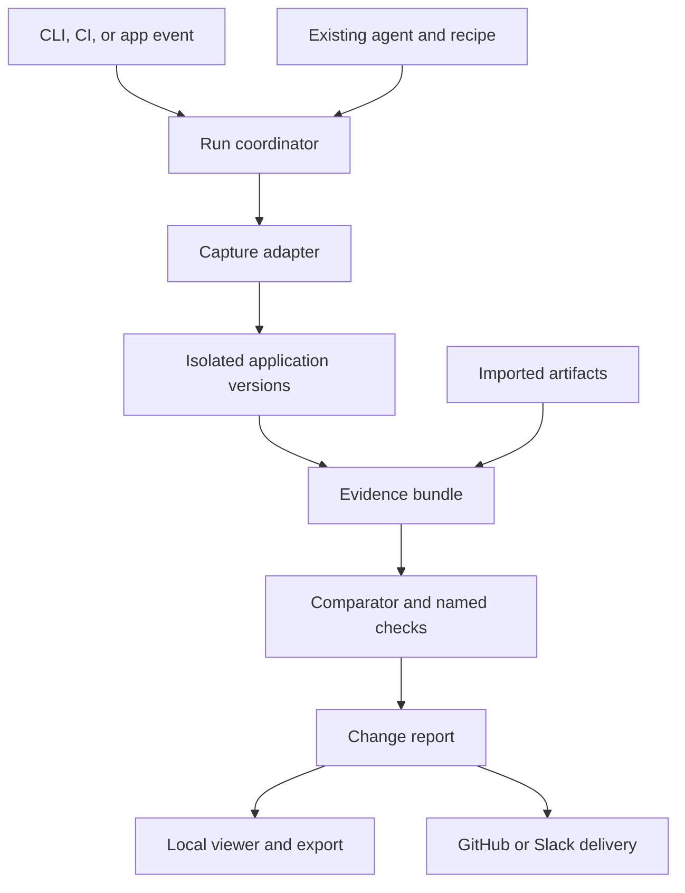
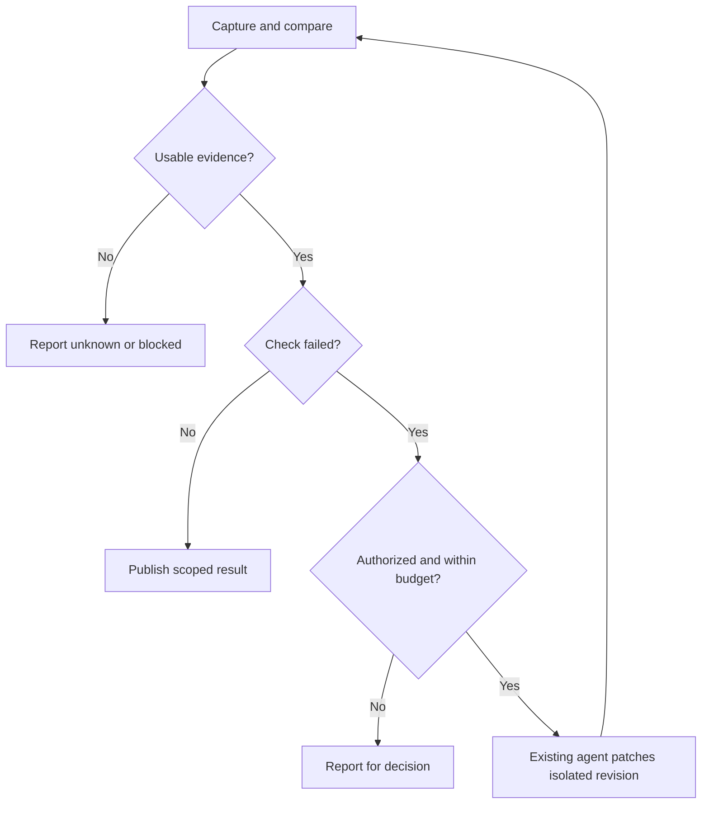

# Observed architecture

Read for capture, data contracts, comparisons, integrations, or repair. [PRODUCT.md](PRODUCT.md) owns scope and result language; [ROADMAP.md](ROADMAP.md) owns sequencing. [AGENTS.md](../AGENTS.md) owns the stack and contributor rules.

## Structure

Use one TypeScript project with capture, comparison, report, and shared-schema modules. Keep the CLI thin. React renders the viewer; it does not enter core evidence types. Split packages only when a second consumer needs a public boundary.

The coordinator owns process lifecycle, timeouts, cancellation, and run identity. Adapters translate tool output. The comparator performs deterministic checks. The report renders results without needing an agent.

## Evidence contract

Start with versioned JSON and ordinary artifact files. Preserve raw output; normalize only what the report needs.

| Record | Required information |
| --- | --- |
| Change | Repository, base, candidate commit or snapshot, changed files, supplied intent |
| Recipe | Stable ID, version or hash, setup, journey, fixtures, expectations, cleanup |
| Run | ID, revision, recipe hash, producer versions, environment, timestamps, completion |
| Evidence | Run and step IDs, kind, producer, value or artifact reference, hash, conditions |
| Check | ID and version, expectation, evidence references, method, result, missing prerequisites |
| Explanation | Claim, supporting evidence IDs, author or model, explicit inference label |

Use explicit links and adapter extension payloads. No graph database or universal ontology is needed. Add SQLite when queryable history, queues, or deduplication justify it. Preserve portable export.

Hashes detect changed artifacts; they do not establish collector honesty. A stack trace can associate a source location with an error. Temporal proximity cannot prove that a changed line caused a slowdown. Expose missing mappings and inferred relationships.

## Comparable and safe runs

- Pin the base. Snapshot intended modified and untracked source for the candidate, excluding credentials and unrelated ignored data.
- Isolate ports, browser profiles, processes, fixtures, and writable directories. Otherwise serialize and reset shared state. Record limitations.
- Match browser, viewport, environment, recipe, and fixture versions. Record deliberate masks and incompatible baselines. A missing baseline is unavailable, not unchanged.
- Warm up timing checks, repeat samples, record spread, and alternate run order where practical. Configure meaningful thresholds and noise handling. Keep intrusive profiling separate from timing gates.
- Let one adapter own a browser session. Declare capabilities and versions. Unsupported evidence must not look like an empty success.
- Keep captures immutable. Redact secrets before export or model access. Validate imported schemas and artifact paths. Treat captured content as data, never executable instructions.
- Validate revision identity before publishing or acting. Make repeated events idempotent. Preserve failed runs and classify flaky outcomes instead of retrying until green.

## Reuse and adapters

Use a thin [agent-browser adapter](https://github.com/vercel-labs/agent-browser) first. Reuse existing Playwright journeys through artifact import; add a dedicated importer only with repeated demand. Keep [native trace viewing](https://playwright.dev/docs/trace-viewer).

Evaluate [Chrome DevTools MCP](https://github.com/ChromeDevTools/chrome-devtools-mcp), [agent-react-devtools](https://github.com/callstackincubator/agent-react-devtools), and [React Doctor](https://github.com/millionco/react-doctor) for gaps demonstrated by real failures. Inspect pinned releases, compatibility, telemetry, and required data access before adoption. Do not run competing collectors merely to support more tools.

Later backend adapters import concrete operation results: response contracts, database readbacks against disposable fixtures, and job events. Preserve [OpenTelemetry trace IDs](https://opentelemetry.io/docs/concepts/signals/traces/) and link to existing storage instead of collecting all production telemetry.

GitHub and Slack adapters consume one normalized result. Bind remote actions to repository, authenticated user, permitted action, and current revision. Recheck authorization at execution. A casual reply is not permission to merge or modify production data. Acknowledge long jobs before running them and retain their job identity.

## Code, skills, and AI

Use code for arithmetic, assertions, hashing, permissions, process ownership, timeouts, retries, and state transitions. Use agents to discover startup paths, propose journeys, explain evidence, and suggest fixes.

Project development skills live in .agents/skills with the Claude symlink. Product users do not need this collection. Keep saved checks executable without an assistant. Offer one optional, versioned Observed skill for an existing assistant when setup needs it. Do not silently alter user instructions or build another assistant runtime.

A configured agent command can handle model choice and authentication. Add direct provider support only for an operation that needs it. Jev is an optional routing experiment, never the authority for measurements, permission, or a passing verdict. See [experiment gates](ROADMAP.md#optional-experiments).

## Bounded repair, later

Send revision, recipe, expected result, actual evidence, and source references to the patch agent. Start with two attempts plus explicit time and cost limits. Stop on no progress, repeated failure, changed intent, or blocked prerequisites.

Protect the comparator, expectations, baselines, and evidence writer from silent changes by the patch agent. A fix creates a new run under the same checks. Imported agent claims remain imported until controlled execution validates them.

Rerun selected checks plus a small required smoke set. Widen for shared configuration, dependencies, schemas, or uncertain impact. Periodic full runs estimate what selection misses. Gate merge eligibility through repository policy, not report wording.

A formal result must include its statement, assumptions, toolchain, dependencies, and implementation connection. Reject incomplete proofs and unexpected assumptions. Keep model proof and runtime evidence separate; neither substitutes for the other.
