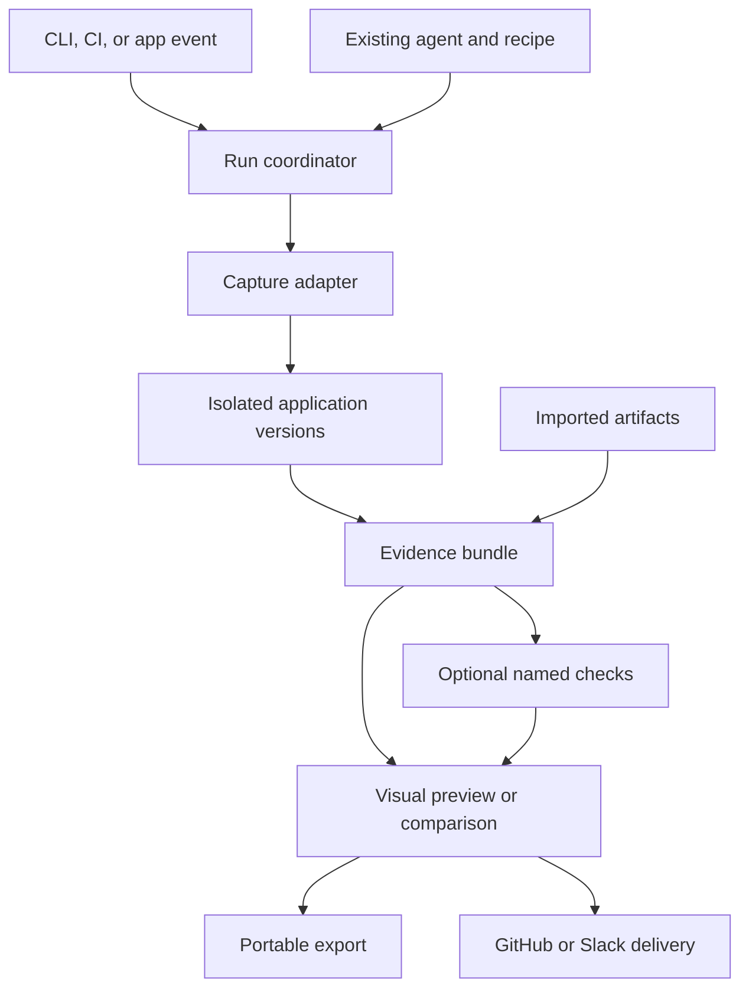
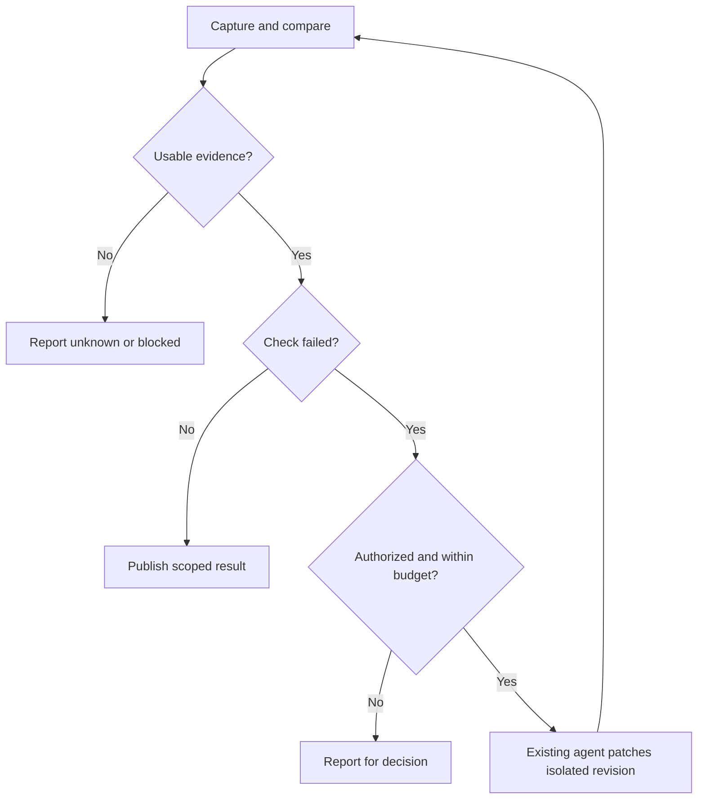

# Observed architecture

A project tells Observed how to start the app and what to capture. Observed keeps
the source identity and evidence together so the result can be opened later.

[Product](PRODUCT.md) covers the experience; [Roadmap](ROADMAP.md) covers sequence.
[AGENTS.md](../AGENTS.md) contains stack and contributor rules.

## Structure

Use one TypeScript project with capture, comparison, report, and shared-schema modules. Keep the CLI thin. React renders the viewer; it does not enter core evidence types. Split packages only when a second consumer needs a public boundary.

```mermaid
flowchart TD
    T["CLI, CI, or app event"] --> C["Run coordinator"]
    A["Existing agent and recipe"] --> C
    C --> P["Capture adapter"]
    P --> I["Isolated application versions"]
    I --> E["Evidence bundle"]
    X["Imported artifacts"] --> E
    E --> V["Visual preview or comparison"]
    E --> K["Optional named checks"]
    K --> V
    V --> R["Portable export"]
    V --> D["GitHub or Slack delivery"]
```

The coordinator starts and stops owned processes and records each run. Adapters
translate browser output. The comparator checks compatible captures and any saved
expectations. The viewer works without an agent.

## Project boundary

Parse a saved project configuration at the CLI boundary. It identifies source
files and revisions, argument-vector setup/start commands, readiness, the browser
journey, and named expectations. Commands are trusted project inputs; page content
and evidence cannot supply commands. Run from isolated source snapshots and pin
one recipe before capture. A comparison uses that same recipe on both sides.
Record the exact bytes used.

The collector executes that recipe. The comparator reads verified observations
and the recorded expectation contract; it imports no application fixture or
browser adapter. Application routes, data, frameworks, and build tools belong to
project configuration and test applications. Keep fixture-specific assertions in
integration tests using the public runner.

Read `observed.json` from the base revision as well as the candidate. Capture
both sides with the candidate's journeys so the captures stay comparable, and
record every difference between the two files in the result. Judge a check
that exists on the base by the base's definition. The rules are in
[PRODUCT.md](PRODUCT.md#change-scope). Today one `observed.json`, read from
the candidate checkout, drives both sides, so an expectation altered by the
change applies to the base without a trace.

## Evidence contract

Start with versioned JSON and ordinary artifact files. Preserve raw output; normalize only what the report needs.

| Record | Required information |
| --- | --- |
| Change | Repository, base, candidate commit or snapshot, changed files with their relation to evidence, recipe differences, supplied intent |
| Recipe | Stable ID, version or hash, setup, journey, fixtures, expectations, cleanup |
| Run | ID, revision, recipe hash, producer versions, Observed version and source commit, environment, timestamps, completion |
| Evidence | Run and step IDs, kind, producer, value or artifact reference, hash, conditions |
| Check | ID and version, expectation, evidence references, method, result, missing prerequisites |
| Explanation | Claim, supporting evidence IDs, author or model, explicit inference label |

Use explicit links and adapter extension payloads. No graph database or universal ontology is needed. Add SQLite when queryable history, queues, or deduplication justify it. Preserve portable export.

Hashes detect changed artifacts; they do not establish collector honesty. A stack trace can associate a source location with an error. Temporal proximity cannot prove that a changed line caused a slowdown. Expose missing mappings and inferred relationships.

### Change scope

Planned for Phase 3a. Not built.

The comparator writes the change scope to `result.json` with the result.
Delivery adapters and the viewer render it and never compute or adjust it.

1. Changed files come from the two source snapshots, which already hash every
   captured file. Files that Git reports as changed outside `source.paths` are
   listed as outside the captured source. Without a base snapshot the scope is
   unavailable, with the reason.
2. A file's relation comes only from recorded evidence. No record means "not
   observed". A file that no collector can execute, such as a stylesheet or a
   type declaration, is "not observed" with that reason.
3. Recipe differences come from comparing the base and candidate
   `observed.json` by journey name and check ID.

Relations, strongest first:

| Evidence on a file | Relation |
| --- | --- |
| An anchor from a stack frame, component source, or test location, on a finding that lists a check | Checked |
| Coverage shows a line in scope ran | Exercised |
| An anchor on a finding that lists no check | Exercised |
| A name match against the diff | Exercised at most, labeled as a match |
| None | Not observed |

The wording and the rules for altered checks are in
[PRODUCT.md](PRODUCT.md#change-scope).

Coverage collectors supply the "exercised" relation. None is built. Probes on
2026-09-29 showed that each source below returns execution counts.

| Runtime | How | Known limit |
| --- | --- | --- |
| Browser | agent-browser 0.38.1 has no coverage command. It prints the browser's DevTools address (`get cdp-url`), and a second DevTools client takes [precise coverage](https://chromedevtools.github.io/devtools-protocol/tot/Profiler/#method-startPreciseCoverage) on the page | On the bundled React example, ranges resolved through the source map to the original files. One run with the second client and one without recorded the same 7 HAR entries and 2 React renders |
| Node server | The same protocol through `--inspect` | Probed on a small JavaScript server. TypeScript and source maps are untested. `NODE_V8_COVERAGE` wrote nothing when the process was stopped with SIGTERM |
| Bun server | Bun's inspector has no `Profiler` domain. `Runtime.enableControlFlowProfiler` and `Runtime.getBasicBlocks` report executed blocks when the server starts with `--inspect-wait` | Offsets are in Bun's transpiled output. Mapping them to source lines is untested, and Bun stays in scope only if it works |
| Other runtimes | A collector per runtime | Not probed. Their files stay "not observed", with that reason |

- Start coverage before the journey's first navigation, or before the server
  loads its code, so code that runs during load counts.
- Attach to the page target by its address. The first page target can be the
  browser's own new-tab page.
- Map ranges to source lines through source maps, then intersect them with the
  changed lines. Today the capture fetches maps only for scripts that an error
  frame or a React component names.
- Run coverage in the separate browser session, never in the one that takes
  timing samples, because instrumentation changes timing.
- Server coverage changes how the app starts. It applies only when the
  project's `start` runs Node or Bun, and the run records that it did.

### Change map data

Planned for Phase 3a. Not built.

The comparator writes the map's blocks and connections to `result.json` with
the change scope. Every connection lists the evidence IDs it came from. The
viewer lays out and draws the map and never adds a block or a connection.

- Imports come from `Bun.Transpiler.scan` on each JavaScript or TypeScript
  file in a snapshot, resolved with `Bun.resolveSync` against that snapshot.
  A probe on 2026-10-03 with Bun 1.4.2 returned the four imports of the
  Request lab's `App.tsx` and resolved all four. The map draws the
  candidate's imports and marks the imports the change removed. Files in
  other languages have no import connections, and the map says so.
- Layout is presentation, not evidence. The viewer uses
  [elkjs](https://github.com/kieler/elkjs) for layered layout with nested
  directories. It is bundled into the built viewer, not installed as a
  package runtime dependency. Observed uses its EPL-2.0 license option, and
  its notice goes into the third-party notices.
- A repository map is a single capture's scope over every file in
  `source.paths`.

Agent descriptions are explanation records from the
[evidence contract](#evidence-contract). Observed validates the file with a
schema, rejects a description that names a file outside the snapshot, redacts
it like any artifact, and renders it as text.

### Replay

Planned for Phase 3a. Not built.

The capture records each side with `agent-browser record start`. The help
text of `agent-browser record` in 0.38.1, read on 2026-10-03, says it
"Requires ffmpeg on PATH with the libvpx and libx264 encoders". A probe that
day showed that the PATH that counts is the one the session's daemon started
with. Without ffmpeg there, `record start` exits 1 with "ffmpeg not found".
Without ffmpeg the replay is unavailable, with that reason, and nothing else
changes. Captions come from the action timeline's steps and
their times.

Record the session that produced the checked evidence, so the replay shows the
run that the verdict describes. Recording can change timing, so a journey with
a timing check records its separate coverage session instead, and the replay
is labeled as a separate run.

### Generated journeys

Planned for Phase 3a. Not built.

An agent supplies generated journeys for one run in a file of their own.
Observed validates them with the journey schema, runs them after the saved
journeys, and records them in the result with their origin. They carry only
baseline checks. They cannot add a check with a written expectation, change a
saved journey, or write to `observed.json`.

Locally the person's agent drives the loop from the guide that
`observed skill` prints, once the guide describes it: run, read the scope,
write journeys for what is not observed, run again, and stop at the budget. In
CI the same loop needs a configured agent command, which belongs to
[Phase 4](ROADMAP.md#status). Observed treats the file as data. A journey
cannot supply a command.

### Source anchors

The collector or importer gathers what anchors need, such as source maps and test locations. Each finding's anchor is resolved from those artifacts and recorded in `result.json` with the result. Delivery adapters and the viewer render anchors; they never compute or adjust them. Each anchor records its basis and whether its line was added, removed, or unchanged in the base..candidate diff.

Resolve anchors in this order:

1. Locations the evidence carries: stack frames and component positions resolved through source maps, and test locations from a test report. The collector follows `sourceMappingURL`, or fetches `<script>.map` for a hidden map, and keeps the maps as artifacts. Maps can embed source text, so redact them like any artifact before export.
2. Name matching against the lines the base..candidate diff changed, such as a component, element id, or route. This basis is weaker and is recorded as a match, not a resolution.
3. Otherwise no anchor, with the reason recorded. Never guess a line.

## Comparable and safe runs

- Snapshot the selected source, including intended worktree changes and untracked files. The snapshot hash identifies a worktree capture; its HEAD commit is recorded as context. Pin the base when comparing versions. Exclude credentials and unrelated ignored data.
- Observed derives observations from producer output, so captures from different Observed versions are not comparable. Under one version, differing or unknown Observed commits and uncommitted tracked changes to Observed leave the pair comparable and appear as limitations. Changes inside the captured project's directory do not count as Observed changes. Recapture a manifest written under an older capture schema; it is reported unavailable, not upgraded.
- Isolate ports, browser profiles, processes, fixtures, and writable directories. Otherwise serialize and reset shared state. Record limitations.
- Match browser, viewport, environment, recipe, and fixture versions when comparing. Record deliberate masks and incompatible baselines. A requested but missing baseline is unavailable. A standalone preview needs no baseline.
- Warm up timing checks, repeat samples, record spread, and alternate run order where practical. Configure meaningful thresholds and noise handling. Keep intrusive profiling separate from timing gates.
- Let one adapter own a browser session. Declare capabilities and versions. Unsupported evidence must not look like an empty success.
- Keep captures immutable. Redact secrets before export or model access. Validate imported schemas and artifact paths. Treat captured content as data, never executable instructions.
- Validate revision identity before publishing or acting. Make repeated events idempotent. Preserve failed runs and classify flaky outcomes instead of retrying until green.

## Reuse and adapters

Use a thin [agent-browser adapter](https://github.com/vercel-labs/agent-browser) first. Existing Playwright tests run or import as imported checks, each labeled "Imported from Playwright". Keep [native trace viewing](https://playwright.dev/docs/trace-viewer).

Evaluate [Chrome DevTools MCP](https://github.com/ChromeDevTools/chrome-devtools-mcp), [agent-react-devtools](https://github.com/callstackincubator/agent-react-devtools), and [React Doctor](https://github.com/millionco/react-doctor) for gaps demonstrated by real failures. Inspect pinned releases, compatibility, telemetry, and required data access before adoption. Do not run competing collectors merely to support more tools.

Later backend adapters import concrete operation results: response contracts, database readbacks against disposable fixtures, and job events. Preserve [OpenTelemetry trace IDs](https://opentelemetry.io/docs/concepts/signals/traces/) and link to existing storage instead of collecting all production telemetry.

GitHub and Slack adapters consume one normalized result. Bind remote actions to repository, authenticated user, permitted action, and current revision. Recheck authorization at execution. A casual reply is not permission to merge or modify production data. Acknowledge long jobs before running them and retain their job identity.

On GitHub, delivery uses the job's own token, scoped by the workflow's `permissions:` and valid only while the job runs. Capture needs no write token, and the capture step's environment gets no GitHub token. Delivery writes only the job's own check run and one comment. An optional user App token is minted after capture and only signs the comment, since only the App that created a check run can update it. Exchanging an Actions OIDC token for an App token needs a hosted service, so any such exchange stays outside core and optional.

Line delivery is planned and not built. On GitHub, every anchored finding becomes a check-run annotation. A review comment is reserved for a regression or new error anchored by a stack frame, component source, or test location; a name match never gets one. Post one review per run, find earlier comments through a hidden finding ID, and reply and resolve the thread when its finding clears instead of posting again.

The planned `/observed` trigger runs only for a comment from a user with write access on a pull request from the same repository. Untrusted pull request code must never run where the GitHub App key or Slack token can be read. If one workflow cannot guarantee that, split it: an unprivileged capture uploads the result, and a privileged delivery started by `workflow_run` reads only that upload. Never use `pull_request_target`. If neither design is safe, fall back to a label trigger on `pull_request`.

## Code, skills, and AI

Use code for arithmetic, assertions, hashing, permissions, process ownership, timeouts, retries, and state transitions. Use agents to discover startup paths, propose journeys, explain evidence, and suggest fixes.

Project development skills live in .agents/skills with the Claude symlink. Product users do not need this collection. Keep saved checks executable without an assistant. Offer one optional, versioned Observed skill for an existing assistant when setup needs it. Do not silently alter user instructions or build another assistant runtime.

A configured agent command can handle model choice and authentication. Add direct provider support only for an operation that needs it. Jev is an optional experiment, never the authority for measurements, permission, or a passing verdict. See [experiment gates](ROADMAP.md#optional-experiments).

## Verifying Observed

Observed's own pull requests run two observations. One captures the Request lab
example with the pull request's build of Observed: one journey and one
`request-count` check. The other uses the previous release to capture the
report viewer on three journeys with six checks, rendered from one stored
fixture. [tests/fixtures/self-observe](../tests/fixtures/self-observe) explains
how to regenerate it. That job pins the previous release by commit SHA and
never `./`, so the pull request's code is only ever the observed side. After
each release, bump the pin.

Neither job exercises most comparator branches, the collectors for other
evidence kinds, or delivery. Observed records a green self-observation. It
never decides whether Observed is correct.

Independent verification uses expectations that the code under test cannot
change:

- A gate corpus of base and candidate pairs with known outcomes, kept in
  separate trial repositories. Write each expected outcome before the run.
- A checker that compares `result.json` with the expected outcome and with the
  raw producer output, such as the HAR. It imports nothing from the comparator.
- Faults seeded into disposable copies of Observed, such as a missing capture
  that counts as a pass. The unit tests and the gate corpus must fail on each.
- Property-based tests of pure verdict logic, with fast-check once it is
  added. State each property without importing the constant it protects. A
  property that reads the precedence order from the code passes against a
  fault in that order.
- Optional, outside CI: for a small finite model of verdict logic, a proven
  model and a conformance run. The conformance run executes the model and the
  real function on the same inputs and lists every disagreement. Seed a fault
  into the conformance script too, because the script can be wrong.

[ROADMAP.md](ROADMAP.md#mvp-release-gates) lists the gates.

## Bounded repair, later

Repair stays out of the first release. A repair loop drives a candidate toward
passing checks, so it is only as sound as those checks. It starts once MVP
gates 1 to 8 hold and does not wait for the pilot. Until then the evidence
handoff prompt is the only repair aid. The same limits apply to recipe
proposals. An agent that proposes a journey cannot also accept it.

```mermaid
flowchart TD
    C["Capture and compare"] --> U{"Usable evidence?"}
    U -->|No| B["Report unknown or blocked"]
    U -->|Yes| F{"Check failed?"}
    F -->|No| S["Publish scoped result"]
    F -->|Yes| P{"Authorized and within budget?"}
    P -->|No| E["Report for decision"]
    P -->|Yes| A["Existing agent patches isolated revision"]
    A --> C
```

Send revision, recipe, expected result, actual evidence, and source references to the patch agent. Start with two attempts plus explicit time and cost limits. Stop on no progress, repeated failure, changed intent, or blocked prerequisites.

Protect the comparator, expectations, baselines, and evidence writer from silent changes by the patch agent. A fix creates a new run under the same checks. Imported agent claims remain imported until controlled execution validates them.

Rerun selected checks plus a small required smoke set. Widen for shared configuration, dependencies, schemas, or uncertain impact. Periodic full runs estimate what selection misses. Gate merge eligibility through repository policy, not report wording.

A formal result must include its statement, assumptions, toolchain, dependencies, and implementation connection. Reject incomplete proofs and unexpected assumptions. Keep model proof and runtime evidence separate; neither substitutes for the other. The implementation connection is its own executed evidence, such as a conformance run of the code against the model's cases. Without it the result reads "model checked, implementation link open" and the overall verdict is unknown.

Checker defaults differ, so a gate names what it rejects. Lean 4.34.1 exits 0 on a proof that uses `sorry` and only warns; the gate must read `#print axioms` and reject `sorryAx`. Bend 2.0.34 exits 1 on an open or missing proof. Its `--verdict` recheck needs Lean 4.34.0 installed, and `@unsafe` and foreign code fall outside it.
