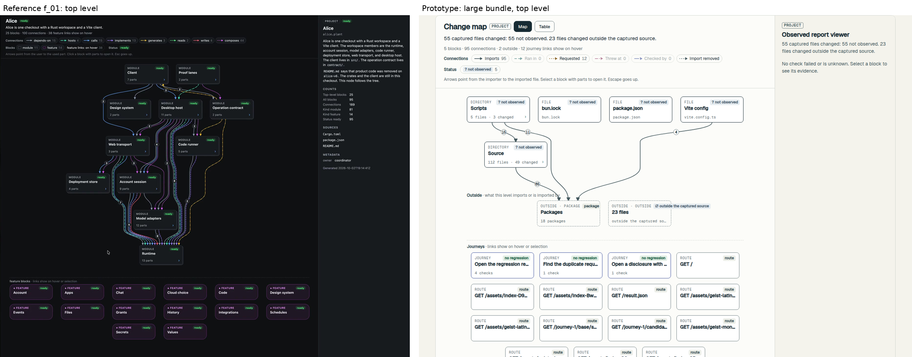
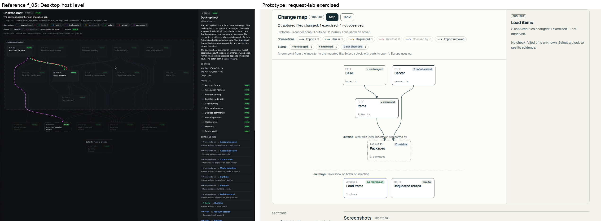

# Change map rework: research

Session D, 2026-10-03. Branch `feat/change-map-rework`, rebased on `d46e3b2`.

The maintainer's words, thread `84ca547e`: "bro wtf is this map. it's ugly these paths + is it going to be small like this? it should at least be a proper section for better visibility and maybe using actually interactive nodes. research first". Later: "if possible, even replicate it", about the _overment repo map.

## What the reference does

Sources: `references/f_01.jpg` to `f_21.jpg`, `scenes/s_01.png` to `s_11.png`, and frames pulled from `v.mp4` (1676x1400, 30 fps, 20.7 s).

Structure, measured from the 1676 px frames:

- Header, about 175 px tall. Title, kind chip, status chip. One plain sentence. A count line: "11 blocks · 22 connections · 6 outside · 10 connections of this block itself: see Details · 2 feature links show on hover". A Connections row of chips, one per type, each with its line sample and a count; zero-count types are dimmed, not hidden. A Blocks row with kind counts and a Status row. A one-line hint: "Arrows point from the user to the used part. Click a block with parts to open it. Esc goes up."
- Canvas, about 1300 px wide. Top level: a top-down layered graph of 11 module cards. Drilled in: a dashed rounded container labeled "Inside Desktop host", a row of dashed OUTSIDE cards under it, then a dashed "Outside: feature blocks" row.
- Cards about 175x78 px. Eyebrow in mono caps (MODULE, FEATURE, OUTSIDE), a status chip at top right, the name in 15 px semibold, then "11 parts" and a chevron when the block has children. Feature cards use a purple-tinted border. Outside cards are dashed and show their kind under the name.
- Edges are curves that run in parallel strands through the gaps between cards, one strand per type, with a numbered badge where several connections share a route. Each type has a color and a dash pattern.
- Right panel, about 375 px. Kind and status chips, name, a mono id, two short paragraphs, SOURCES (paths), PARTS (n) with a status per part, OUTGOING (n) and INCOMING (n). Each connection row is "line sample, type, to/from, target name as a link", then a disclosure line with the reason.

Motion, from frame-by-frame luma and the strips in `/tmp/dref`:

- Hover focus fades in over 3 to 4 frames, about 100 to 130 ms. Unrelated cards and edges drop to roughly 25% opacity. Related edges brighten and draw their count badges.
- Hovering an edge opens a tooltip: "Account session → Runtime, 5 connections: 1 depends-on, 2 calls, 1 implements, 1 writes", one row per connection with its reason.
- Drill-in is a cut. The canvas is blank for one frame, then the child level appears with no zoom or slide. Header and panel switch in the same frame.
- No pan, zoom or drag anywhere in the video. The page scrolls.

## What we have

`references/current-change-map.png` is #76 on a request-lab run where three files changed outside the captured source.

- The map sits in a 700 px column beside a 320 px panel inside the report's body column, so it gets about half the page.
- Blocks are labeled with project-relative paths, so a repo-root file reads `../../DESIGN.md`. Session B's `5147dcf` records `changeScope.outside.projectDirectory` (result schema 9) so paths can start from the repository root.
- The map leads the page even when it has nothing to draw except files outside the captured source.
- Connections draw straight from the bottom center of one block to the top center of the next. ELK's edge routes are computed and thrown away, so edges cross blocks.
- #75's altered checks and removed journeys don't appear on the map.

## Skills used

| Skill | What it contributed |
| --- | --- |
| observed-mode | Decide design questions inside DESIGN.md without asking; verify in a real browser with agent-browser; record platform limits with a source and date. |
| dataviz | Ran its palette validator on the DESIGN.md connection colors. Light: imports `#45595E` and ran-in `#276A6A` are ΔE 5.4 apart for normal vision and 3.2 under deuteranopia, below its floors of 15 and 8. Dark fails the same pair. The dash patterns are the secondary encoding, but the colors alone don't separate. Its interaction rules also apply: hover detail must be reachable by keyboard, hit targets larger than marks, a table view. |
| web-design-guidelines | Fetched the current Vercel list. Applicable: visible `:focus-visible` on every node, `prefers-reduced-motion` for the dim transition, `touch-action: manipulation`, no gesture-only actions, `overscroll-behavior: contain` on the scrolling canvas, `aria-live="polite"` for drill changes. |
| vercel-react-best-practices | `bundle-*`: the single-file report can't lazy-load a chunk, so size has to come off the main bundle. `js-index-maps`: the current canvas calls `map.blocks.find` and `connections.indexOf` inside render loops. `rerender-derived-state-no-effect`: a synchronous layout can be a `useMemo` instead of an effect with a loading state. |
| react-doctor 0.9.14 | Run with a pinned `bunx`, since AGENTS.md rules out npx. Score 72 for the repository. On the map: array-index keys at `change-map.tsx:449` and `:1144`, high complexity in `MapCanvas` and `ChangeScopeView`, a missing index map in `src/change-map.ts:429`. Its installer was not run; it would add npm-based scripts. |
| ui-taste | The map-plus-sidebar pattern, restrained hover (color and opacity, no scale), duration matched to element size. Its shadcn and Tailwind setup does not apply here. |
| typescript-best-practices | For the build: parse at the boundary, discriminated unions for block kinds and selection, no assertions. |
| unslop | Applied to this file. |

Graph and diagram skills found in registries, searched 2026-10-03:

- [framara/react-flow-skill](https://github.com/framara/react-flow-skill) (MIT). Its `references/accessibility.md` covers `ariaLabelConfig`, labels, focusable props and keyboard alternatives to dragging. The most useful skill for a React Flow map. Not loaded, since React Flow was not chosen.
- [openai/plugins build-web-data-visualization](https://github.com/openai/plugins/tree/main/plugins/build-web-data-visualization/skills) (MIT). `node-link-and-diagram-layout` and `accessibility-and-inclusive-visualization` say to keep layout stable across revisions and to keep a text outline of nodes, groups and edges. Both ideas are in the build: the layout is deterministic, and the table view is the outline.
- [existential-birds/beagle](https://github.com/existential-birds/beagle) (Apache-2.0) has React Flow and dagre skills with almost nothing on accessibility.
- anthropics/skills has nothing for graphs. No skill found covers an accessible read-only node map end to end. cursor/plugins and the awesome lists were not searched.

## Bundle

Measured on 2026-10-03 with `bun build --minify`, React external, gzip -9.

| Library | Version | License | min | gzip |
| --- | --- | --- | --- | --- |
| elkjs (`elk.bundled.js`) | 0.12.0 | EPL-2.0 OR GPL-3.0-or-later | 1,474 KB | 443 KB |
| @dagrejs/dagre | 3.1.1 | MIT | 49 KB | 17 KB |
| @xyflow/react (ReactFlow, Background, Controls) | 12.12.0 | MIT | 184 KB | 60 KB, plus 2.4 KB `base.css` |
| cytoscape | 3.34.3 | MIT | 453 KB | 142 KB |

The viewer was 139 KB gzipped before #76 and 587 KB after (`evidence/change-map/NOTES.md`). elkjs is about 443 KB of that 448 KB growth.

## Layout engines on real data

Real bundle: Observed observing itself from `079773d` to `1198aca`, run by `D/run-large.sh` into `D/runs/large-20261003T143806Z`. The map has 176 blocks (143 files, 18 packages, 3 journeys, 12 routes) and 366 connections; 78 files changed, 55 not observed and 23 outside the captured source.

One drill level at a time, 176x72 px cards, file and directory children only:

| Level | Nodes | Edges | dagre width x height | ELK layered width x height |
| --- | --- | --- | --- | --- |
| src | 42 | 107 | 4492 x 1480 (ranks 4, 9, 7, 4, 3, 2, 5, 1, 3, 1, 2, 1) | 4036 x 1802 |
| src/viewer | 17 | 31 | 1960 x 584 | 1679 x 690 |
| src/capture | 13 | 19 | 1316 x 456 | 1493 x 518 |

Both engines put most of `src` in a few wide ranks, about three viewport widths at 1440 px. ELK's `wrapping.strategy: MULTI_EDGE` with aspect ratio 1.6 changed nothing on these graphs. The reference never shows more than about 12 cards in a level, so it never meets this problem. Our levels can hold 40.

## Other tools

Checked 2026-10-03 from docs and source; screenshots of several are in `references/external/`.

| Tool | Engine | Pattern worth taking |
| --- | --- | --- |
| Nx graph | cytoscape + cytoscape-dagre | Folder containers labeled `./apps (5 / 5)`; a side panel with direct dependencies and dependents; focus a project with a depth control; clicking an edge lists the files behind it |
| Turborepo devtools (2.7) | reactflow 11 with its `base.css`, hand-written depth layout | Title is the package name, subtitle the path; selection modes "depends on" and "affects"; others drop to 0.2 opacity |
| CodeSee review maps | not found | Added, modified and removed colors; unchanged files that depend on a changed file get their own state; a "show unchanged files" toggle |
| dependency-cruiser | Graphviz | Hover highlights, click pins, Escape clears; `--affected <rev>` shows changed modules and what reaches them; `--collapse` to folders |
| GitHub dependency graph | table | Search and filters; "Show paths" explains how a transitive dependency got in |
| Structurizr | not found | Keyboard model: `n` select by name, `i` legend, `c` fit, `b` back, arrow keys |
| Archify (external screenshot) | not found | Upstream and downstream reach counts on the selected node |

The coordinator's reference set (`references/external/INDEX.md`) adds four that fill gaps the _overment map leaves. The _overment map stays the target; these only answer what it doesn't have to.

| Reference | What it does | What the build takes |
| --- | --- | --- |
| Nx project graph (`architecture-nx-project-graph*.png`) | A folder folds into one node with a count (`./apps (5 / 5)`). Clicking a node opens a panel with kind, root path, direct dependencies, direct dependents, then Focus and Start trace. Unrelated nodes fade to gray. | Directories are already single cards with "N files · M changed". A crowded level also folds its unchanged files into one "N unchanged files" card that opens like a directory. The panel lists outgoing and incoming as Nx lists dependencies and dependents. |
| Archify (`architecture-archify-focus-reach.png`) | The focused node and its reach sit in the URL hash (`#focus=planner&reach=downstream`), so a link opens that exact view. Reach is counted: Upstream 2, Downstream 8, "8 nodes, 8 links, max 5 hops". | The open level and selected block go in the hash (`#map=src/viewer&block=file:src/viewer/change-map.tsx`), so a PR comment or a teammate can link to one block. The panel counts reach over recorded imports, upstream and downstream, with the hop limit stated. |
| GitHub Next repo visualizer (`architecture-githubnext-repo-visualization*.png`) | One circle-packing layout with switchable color layers: file type, last change date, number of changes. Import edges appear only when a file is hovered. | One layout. Color carries one channel, the evidence relation (checked, exercised, not observed, outside, unchanged). On a crowded level, edges rest faded and draw in full only for the block in focus. A second color layer was not added: the relation is the channel that answers the review question, and a switch would add a control without new evidence. |
| HumanLayer show-me (`architecture-showme-file-tree-diff.png`, `-call-stack-diff.png`) | A nested tree with a `+` or `-` gutter and one note per file, `# unchanged` for files read but not edited. The call-stack diff nests the new subtree where it now runs. | The table view becomes a file tree with a change gutter (`+` added, `~` modified, `-` removed), the relation chip, and the one-sentence detail per file. It is also the lead view when no captured file changed: the tree shows the outside files with their count, in place of an empty map. |

Taken into the build: name plus path subtitle, unchanged context files hidden on crowded levels (CodeSee's toggle), Escape to clear then go up (dependency-cruiser), edge tooltip listing the connections behind it (Nx), packages and routes folded into one card each (Nx's composite nodes).

## Map and page constraints

- CSP. `src/report-page.ts:85` allows one hashed script and one hashed stylesheet, with no `unsafe-inline`. React sets styles through the DOM, which CSP allows, so StyleX dynamic styles and React Flow's transforms both work. A library's base CSS would join the one hashed stylesheet at build time.
- Styling. AGENTS.md: StyleX only, no second styling system. React Flow needs `base.css` (13.6 KB) for its pane, viewport and handle positioning, so adopting it needs a maintainer exception.
- React Flow's accessibility, from its docs and the 12.12.0 source: nodes are focusable groups, Enter selects, Escape deselects, arrows move a selected node. Nothing moves focus between neighbors, the wrapper has `role="application"`, edge labels default to raw IDs, and the default descriptions say "Press delete to remove it". A read-only map would override most of that.
- Accessibility. DESIGN.md:292 asks for every block and connection reachable by keyboard in reading order, Enter to open, Escape to go up, and agent text in the inference color with an "Agent description" label.

## Decision

Keep our own renderer: HTML buttons for blocks and one SVG for connections, all StyleX. Replace elkjs with a layered layout written for this map (`src/viewer/map-layout.ts`, about 500 lines).

- Bundle. elkjs is 443 KB of the 587 KB viewer. The prototype build is 158 KB gzipped, 429 KB less. React Flow would add 60 KB back, plus a layout engine.
- Width. Neither ELK nor dagre caps a rank's width, and our levels hold up to 42 blocks. Our layout wraps a rank onto extra rows at the measured width, so the map fits 1440 and 390 px without sideways scrolling in the common case.
- Look. The reference routes edges as parallel strands through the gaps between cards. A layered layout with lane slots for long edges gives the same result; the prototype draws one strand per connection type with a count badge.
- Interaction. The reference has no pan, zoom or drag. Cards are native buttons, so focus, Enter, forced colors and screen readers work without the `role="application"` wrapper and the overrides React Flow would need.
- Styling. No stack exception. React Flow would need `base.css`, which AGENTS.md rules out without the maintainer.
- License. Dropping elkjs also drops an EPL-2.0 dependency from the bundle.
- Rejected. Cytoscape, sigma and G6 draw on canvas and give nodes no keyboard or ARIA model. dagre is small (17 KB) but has open bugs with nested graphs and no rank width cap.

The layout is deterministic: the same level at the same width gives the same picture, with ties broken by ID.

## Prototype

Built in the real files on this branch, on real bundles, served with `D/serve.ts` so each report loads the new viewer build. Screenshots in `D/shots/proto/`.

| View | Reference | Prototype |
| --- | --- | --- |
| Top level | `f_01.jpg` | `large-1440-map.png`, side by side in `compare-root.png` |
| A small level | `f_05.jpg` | `exercised-1440.png`, side by side in `compare-small.png` |
| Phone | none | `exercised-390.png` |
| A crowded level | none | `large-src-1440-map.png` |

What the prototype showed:

- The structure carries over. Top level: Scripts and Source directories with "5 files · 3 changed", root files, a dashed outside row, and the journey row with links on hover. The badges (15, 11, 65, 4) say how many imports each strand carries.
- 18 package cards swamped the outside row, so packages became one "Packages" card that lists them in the panel. 12 route cards did the same to the journey row and became one "Requested routes" card.
- `bun.lock` was named "Bun". Only JavaScript and TypeScript files get a readable name now ("Change map" for `change-map.tsx`); other files keep their filename.
- The `src` level is the hard case: 42 blocks and 224 connections. Tightening the ranks cut it from 16 rows deep, and resting edges are faded when a level has more than 40 strands, but it still reads as a tangle. The build hides unchanged context files on crowded levels behind a "Show unchanged files" control, as CodeSee does.
- At 390 px a rank holds one card per row, and the header's legend takes most of the first screen. The build moves the legend into a disclosure on narrow screens.
- The DESIGN.md connection colors don't separate (dataviz validator above). The build picks new ones and reruns the validator in both themes.

## Unresolved

- Agent descriptions: the result has no field for them, so the interpretation lane stays empty and the core works without a model, as AGENTS.md requires.
- Session B's `projectDirectory` (schema 9) isn't on main yet. The map reads it when present (`repoPath` in `map-view.ts`); until then outside files show as a count, which needs no path.
