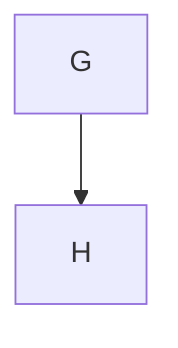
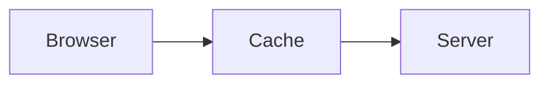
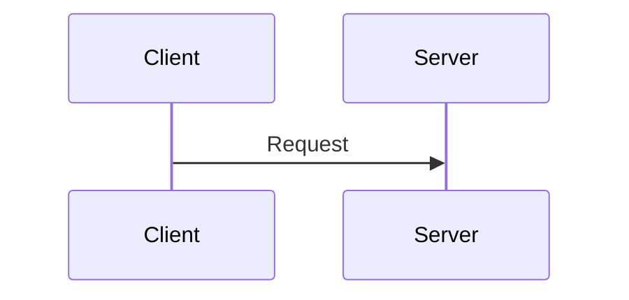

# Diagrams

## Renamed and moved heading

```mermaid
flowchart TD
  G --> H
```

## Changed

```mermaid
flowchart LR
  A[Browser] --> B[Cache] --> C[Server]
```

## Added

```mermaid
flowchart LR
  New --> Node
```

## Parse error

```mermaid
this is not a diagram
```

## Unchanged

```mermaid
sequenceDiagram
  Client->>Server: Request
```
